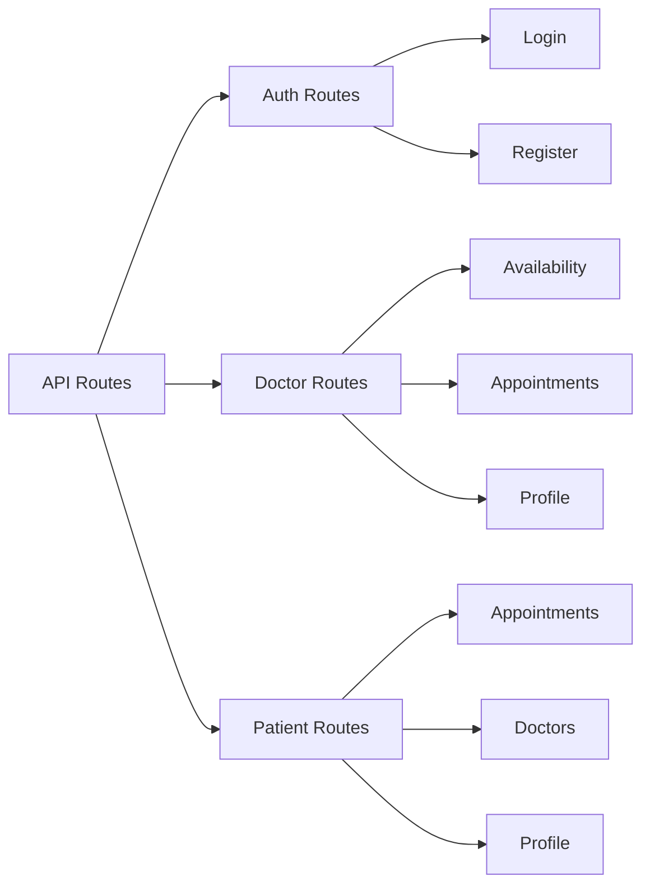

# Backend API Documentation

This section documents the backend REST API endpoints for the Medical Appointment System.

## API Overview

The backend provides RESTful API endpoints for:

- User authentication (login, registration)
- Doctor availability management
- Appointment scheduling and management
- Doctor and patient information retrieval

## API Structure



## Authentication

All protected routes require a valid JWT token provided in the Authorization header:

```
Authorization: Bearer [JWT_TOKEN]
```

## Available Endpoints

### Authentication Endpoints

Detailed documentation: [Auth API](auth.md)

- `POST /api/auth/login` - User login
- `POST /api/auth/register` - User registration

### Doctor Endpoints

Detailed documentation: [Doctor API](doctor.md)

- `GET /api/doctors/appointments` - Get doctor's appointments
- `PATCH /api/doctors/appointments/:id/status` - Update appointment status
- `GET /api/doctors/availability` - Get doctor's availability
- `POST /api/doctors/availability` - Set doctor's availability
- `DELETE /api/doctors/availability/:id` - Delete availability slot
- `GET /api/doctors/:id/slots` - Get doctor's available time slots for a specific date

### Patient Endpoints

Detailed documentation: [Patient API](patient.md)

- `GET /api/patients/appointments` - Get patient's appointments
- `POST /api/patients/appointments` - Schedule a new appointment
- `GET /api/doctors` - Get all doctors
- `GET /api/doctors/:id` - Get doctor details

## Error Handling

The API uses standard HTTP status codes to indicate the success or failure of requests:

- 200 - OK
- 201 - Created
- 400 - Bad Request
- 401 - Unauthorized
- 403 - Forbidden
- 404 - Not Found
- 500 - Internal Server Error

Error responses follow this format:

```json
{
  "success": false,
  "message": "Error message description"
}
```

## Response Format

Successful responses generally follow this format:

```json
{
  "success": true,
  "data": {
    // Response data
  }
}
```
