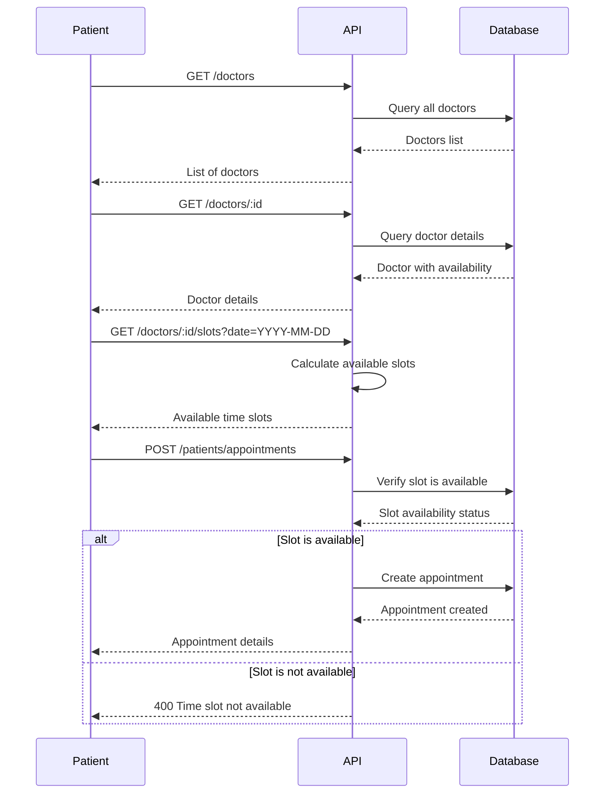

# Patient API

The Patient API provides endpoints for managing patient-specific functionalities, including appointment scheduling and doctor discovery.

## Appointments

### Get Patient's Appointments

Retrieves all appointments for the authenticated patient.

**URL**: `/api/patients/appointments`

**Method**: `GET`

**Auth required**: Yes (Patient role)

**Success Response**:

- **Code**: 200 OK
- **Content**:
  ```json
  [
    {
      "id": "string",
      "patientId": "string",
      "doctorId": "string",
      "patientName": "string",
      "doctorName": "string",
      "doctorSpecialty": "string",
      "dateTime": "2023-06-01T10:00:00Z",
      "status": "scheduled|completed|cancelled",
      "createdAt": "2023-05-25T14:32:21Z",
      "updatedAt": "2023-05-25T14:32:21Z"
    }
  ]
  ```

**Error Responses**:

- **Code**: 401 Unauthorized
  - **Content**: `{ "message": "Not authenticated" }`
- **Code**: 403 Forbidden
  - **Content**: `{ "message": "Not authorized. Patients only." }`

### Schedule Appointment

Creates a new appointment for the authenticated patient.

**URL**: `/api/patients/appointments`

**Method**: `POST`

**Auth required**: Yes (Patient role)

**Request body**:

```json
{
  "doctorId": "string",
  "dateTime": "2023-06-01T10:00:00Z"
}
```

**Success Response**:

- **Code**: 201 Created
- **Content**:
  ```json
  {
    "id": "string",
    "patientId": "string",
    "doctorId": "string",
    "patientName": "string",
    "doctorName": "string",
    "doctorSpecialty": "string",
    "dateTime": "2023-06-01T10:00:00Z",
    "status": "scheduled",
    "createdAt": "2023-05-25T15:45:33Z",
    "updatedAt": "2023-05-25T15:45:33Z"
  }
  ```

**Error Responses**:

- **Code**: 400 Bad Request
  - **Content**: `{ "message": "Doctor ID is required" }`
  - **Content**: `{ "message": "Date and time are required" }`
  - **Content**: `{ "message": "Invalid date format" }`
  - **Content**: `{ "message": "Cannot schedule appointment in the past" }`
  - **Content**: `{ "message": "Time slot not available" }`
- **Code**: 401 Unauthorized
  - **Content**: `{ "message": "Not authenticated" }`
- **Code**: 403 Forbidden
  - **Content**: `{ "message": "Not authorized. Patients only." }`
- **Code**: 404 Not Found
  - **Content**: `{ "message": "Doctor not found" }`

## Doctors

### Get All Doctors

Retrieves a list of all available doctors.

**URL**: `/api/doctors`

**Method**: `GET`

**Auth required**: Yes

**Success Response**:

- **Code**: 200 OK
- **Content**:
  ```json
  [
    {
      "id": "string",
      "username": "string",
      "doctorProfile": {
        "id": "string",
        "specialty": "string"
      }
    }
  ]
  ```

**Error Responses**:

- **Code**: 401 Unauthorized
  - **Content**: `{ "message": "Not authenticated" }`

### Get Doctor Details

Retrieves details for a specific doctor.

**URL**: `/api/doctors/:id`

**Method**: `GET`

**Auth required**: Yes

**URL Parameters**:

- `id`: Doctor ID

**Success Response**:

- **Code**: 200 OK
- **Content**:
  ```json
  {
    "id": "string",
    "username": "string",
    "doctorProfile": {
      "id": "string",
      "specialty": "string",
      "availability": [
        {
          "id": "string",
          "dayOfWeek": 1,
          "startTime": "09:00",
          "endTime": "17:00"
        }
      ]
    }
  }
  ```

**Error Responses**:

- **Code**: 401 Unauthorized
  - **Content**: `{ "message": "Not authenticated" }`
- **Code**: 404 Not Found
  - **Content**: `{ "message": "Doctor not found" }`

## Appointment Scheduling Flow


