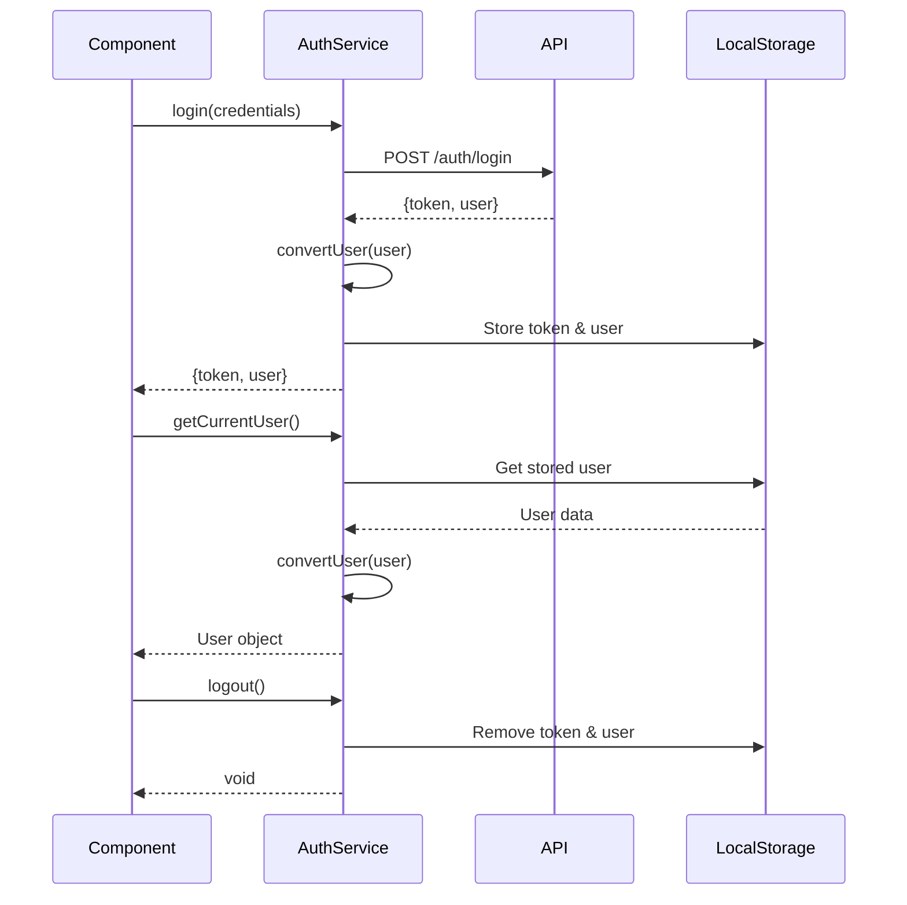

# Authentication Service Documentation

The Authentication Service provides the frontend functionality for user authentication, registration, and session management.

## Overview

The Auth Service is responsible for:

1. User login and registration
2. Session management using localStorage
3. Retrieval and storage of user information
4. Managing authentication state throughout the application

## Service Interface

```typescript
interface authService {
  login(credentials: LoginRequest): Promise<AuthResponse>;
  register(data: RegisterRequest): Promise<AuthResponse>;
  logout(): void;
  getCurrentUser(): User | null;
  setAuthData(token: string, user: User): void;
}
```

## Types

### LoginRequest

```typescript
interface LoginRequest {
  username: string;
  password: string;
}
```

### RegisterRequest

```typescript
interface RegisterRequest {
  username: string;
  password: string;
  type: "patient" | "doctor";
  specialty?: string; // Required if type is 'doctor'
}
```

### AuthResponse

```typescript
interface AuthResponse {
  token: string;
  user: User;
}
```

### User

```typescript
interface User {
  id: string;
  username: string;
  type: "patient" | "doctor";
  doctorProfile?: {
    id: string;
    specialty: string;
  };
}
```

## Methods

### login

Authenticates a user with the provided credentials.

```typescript
async login(credentials: LoginRequest): Promise<AuthResponse>
```

**Parameters**:

- `credentials`: An object containing username and password

**Returns**:

- Promise resolving to an AuthResponse object containing the JWT token and user object

**Throws**:

- Error if authentication fails

**Example**:

```typescript
try {
  const { token, user } = await authService.login({
    username: "johndoe",
    password: "password123",
  });

  // Authentication successful
  console.log(`Logged in as ${user.username}`);
} catch (error) {
  // Handle authentication error
  console.error("Login failed:", error);
}
```

### register

Registers a new user with the provided details.

```typescript
async register(data: RegisterRequest): Promise<AuthResponse>
```

**Parameters**:

- `data`: An object containing user registration information

**Returns**:

- Promise resolving to an AuthResponse object containing the JWT token and user object

**Throws**:

- Error if registration fails

**Example**:

```typescript
try {
  const { token, user } = await authService.register({
    username: "johndoe",
    password: "password123",
    type: "doctor",
    specialty: "Cardiology",
  });

  // Registration successful
  console.log(`Registered and logged in as ${user.username}`);
} catch (error) {
  // Handle registration error
  console.error("Registration failed:", error);
}
```

### logout

Logs out the current user by removing authentication data from local storage.

```typescript
logout(): void
```

**Returns**:

- void

**Example**:

```typescript
authService.logout();
// User is now logged out
```

### getCurrentUser

Retrieves the currently authenticated user from local storage.

```typescript
getCurrentUser(): User | null
```

**Returns**:

- User object if user is authenticated, null otherwise

**Example**:

```typescript
const currentUser = authService.getCurrentUser();

if (currentUser) {
  console.log(`Current user: ${currentUser.username}`);
} else {
  console.log("No user is logged in");
}
```

### setAuthData

Stores authentication data in local storage.

```typescript
setAuthData(token: string, user: User): void
```

**Parameters**:

- `token`: JWT authentication token
- `user`: User object

**Returns**:

- void

**Example**:

```typescript
const token = "eyJhbGciOiJIUzI1NiIsInR5cCI6IkpXVCJ9...";
const user = {
  id: "123",
  username: "johndoe",
  type: "doctor",
  doctorProfile: {
    id: "456",
    specialty: "Cardiology",
  },
};

authService.setAuthData(token, user);
// Auth data is now stored in local storage
```

## Internal Implementation

The Auth Service includes a helper function `convertUser` that ensures consistent type handling:

```typescript
const convertUser = (apiUser: ApiResponse["user"]): User => ({
  ...apiUser,
  id: apiUser.id.toString(),
  doctorProfile: apiUser.doctorProfile
    ? {
        ...apiUser.doctorProfile,
        id: apiUser.doctorProfile.id.toString(),
      }
    : undefined,
});
```

This function converts numeric IDs to strings for consistent handling throughout the application.

## Authentication Flow



## Usage with Authentication Context

The Auth Service is typically used with React's Context API for global state management:

```tsx
// In AuthContext.tsx
import { createContext, useState, useEffect, useContext } from "react";
import { authService } from "../services/shared/auth.service";
import { User } from "../types/shared/auth.types";

const AuthContext = createContext<{
  user: User | null;
  token: string | null;
  login: (username: string, password: string) => Promise<void>;
  register: (data: RegisterRequest) => Promise<void>;
  logout: () => void;
}>({
  user: null,
  token: null,
  login: async () => {},
  register: async () => {},
  logout: () => {},
});

export const AuthProvider = ({ children }) => {
  const [user, setUser] = useState<User | null>(null);
  const [token, setToken] = useState<string | null>(null);

  useEffect(() => {
    // Load user from localStorage on component mount
    const user = authService.getCurrentUser();
    const token = localStorage.getItem("token");

    setUser(user);
    setToken(token);
  }, []);

  const login = async (username: string, password: string) => {
    const response = await authService.login({ username, password });
    setUser(response.user);
    setToken(response.token);
  };

  const register = async (data: RegisterRequest) => {
    const response = await authService.register(data);
    setUser(response.user);
    setToken(response.token);
  };

  const logout = () => {
    authService.logout();
    setUser(null);
    setToken(null);
  };

  return (
    <AuthContext.Provider value={{ user, token, login, register, logout }}>
      {children}
    </AuthContext.Provider>
  );
};

export const useAuth = () => useContext(AuthContext);
```
