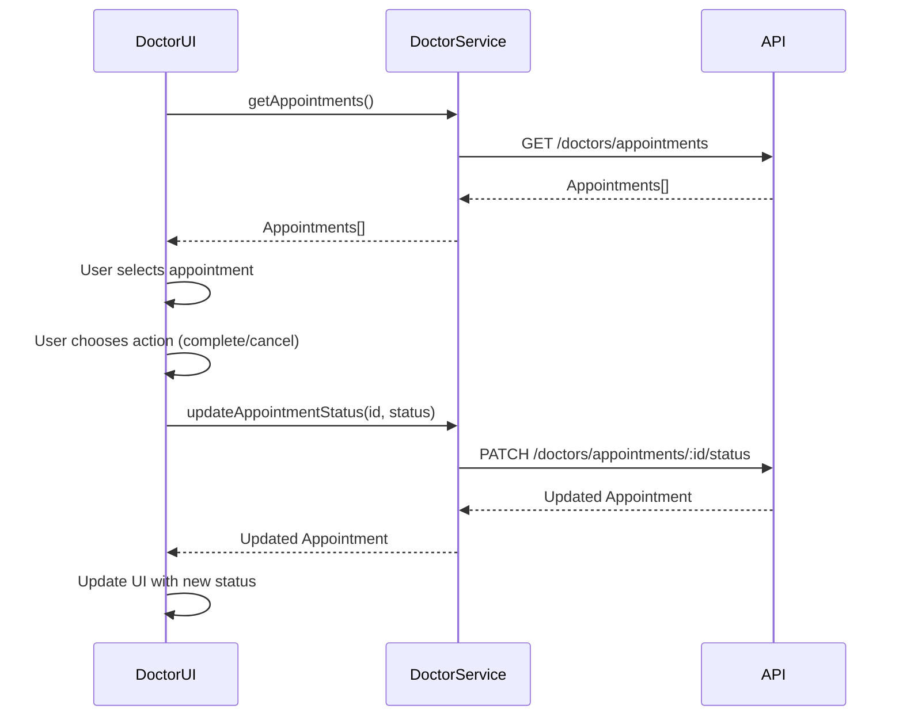
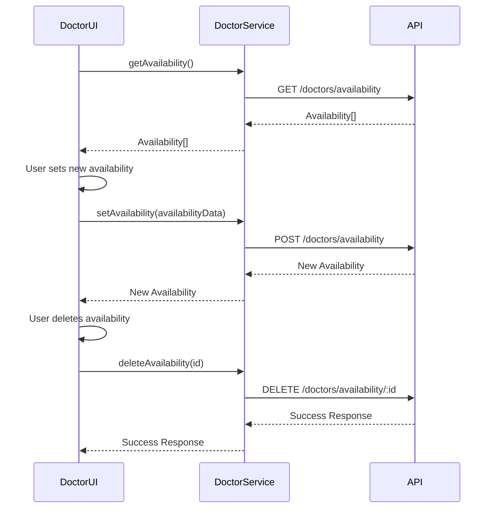

# Doctor Service Documentation

The Doctor Service provides the frontend functionality for doctor-specific operations, including appointment management and availability settings.

## Overview

The Doctor Service is responsible for:

1. Retrieving and managing doctor appointments
2. Setting and retrieving doctor availability
3. Updating appointment status (completing or cancelling appointments)
4. Getting available time slots for specific dates

## Service Interface

```typescript
interface doctorService {
  getAppointments(): Promise<Appointment[]>;
  getAvailability(): Promise<Availability[]>;
  getDoctorAvailability(doctorId: string): Promise<Availability[]>;
  setAvailability(availabilityData: AvailabilityRequest): Promise<Availability>;
  deleteAvailability(availabilityId: string): Promise<void>;
  updateAppointmentStatus(
    appointmentId: string,
    status: AppointmentStatus
  ): Promise<Appointment>;
}
```

## Types

### Appointment

```typescript
interface Appointment {
  id: string;
  patientId: string;
  doctorId: string;
  patientName: string;
  doctorName: string;
  dateTime: string; // ISO date string
  status: AppointmentStatus;
  createdAt: string;
  updatedAt: string;
}
```

### AppointmentStatus

```typescript
type AppointmentStatus = "scheduled" | "completed" | "cancelled";
```

### Availability

```typescript
interface Availability {
  id: string;
  doctorId: string;
  dayOfWeek: number; // 0 = Sunday, 6 = Saturday
  startTime: string; // Format: "HH:mm"
  endTime: string; // Format: "HH:mm"
  createdAt: string;
  updatedAt: string;
}
```

### AvailabilityRequest

```typescript
interface AvailabilityRequest {
  dayOfWeek: number; // 0 = Sunday, 6 = Saturday
  startTime: string; // Format: "HH:mm"
  endTime: string; // Format: "HH:mm"
}
```

### CalendarEvent

```typescript
interface CalendarEvent {
  id: string;
  title: string;
  start: string; // ISO date string
  end: string; // ISO date string
  status: AppointmentStatus;
  patientId: string;
  doctorId: string;
}
```

## Methods

### getAppointments

Retrieves all appointments for the authenticated doctor.

```typescript
async getAppointments(): Promise<Appointment[]>
```

**Returns**:

- Promise resolving to an array of Appointment objects

**Throws**:

- Error if the request fails

**Example**:

```typescript
try {
  const appointments = await doctorService.getAppointments();

  // Handle appointments
  console.log(`Retrieved ${appointments.length} appointments`);
} catch (error) {
  // Handle error
  console.error("Failed to fetch appointments:", error);
}
```

### getAvailability

Retrieves all availability settings for the authenticated doctor.

```typescript
async getAvailability(): Promise<Availability[]>
```

**Returns**:

- Promise resolving to an array of Availability objects

**Throws**:

- Error if the request fails

**Example**:

```typescript
try {
  const availabilitySettings = await doctorService.getAvailability();

  // Handle availability settings
  console.log(`Retrieved ${availabilitySettings.length} availability settings`);
} catch (error) {
  // Handle error
  console.error("Failed to fetch availability settings:", error);
}
```

### getDoctorAvailability

Retrieves all availability settings for a specific doctor by ID.

```typescript
async getDoctorAvailability(doctorId: string): Promise<Availability[]>
```

**Parameters**:

- `doctorId`: ID of the doctor to retrieve availability for

**Returns**:

- Promise resolving to an array of Availability objects

**Throws**:

- Error if the request fails (except 404 errors, which return an empty array)

**Example**:

```typescript
try {
  const doctorId = "123";
  const availabilitySettings = await doctorService.getDoctorAvailability(
    doctorId
  );

  // Handle availability settings
  console.log(
    `Retrieved ${availabilitySettings.length} availability settings for doctor ${doctorId}`
  );
} catch (error) {
  // Handle error
  console.error(
    `Failed to fetch availability settings for doctor ${doctorId}:`,
    error
  );
}
```

### setAvailability

Creates a new availability slot for the authenticated doctor.

```typescript
async setAvailability(availabilityData: AvailabilityRequest): Promise<Availability>
```

**Parameters**:

- `availabilityData`: Object containing the availability details (day of week, start time, end time)

**Returns**:

- Promise resolving to the created Availability object

**Throws**:

- Error if the request fails

**Example**:

```typescript
try {
  const availabilityData = {
    dayOfWeek: 1, // Monday
    startTime: "09:00",
    endTime: "17:00",
  };

  const newAvailability = await doctorService.setAvailability(availabilityData);

  // Handle new availability
  console.log(`Created new availability slot with ID: ${newAvailability.id}`);
} catch (error) {
  // Handle error
  console.error("Failed to create availability slot:", error);
}
```

### deleteAvailability

Deletes a specific availability slot.

```typescript
async deleteAvailability(availabilityId: string): Promise<void>
```

**Parameters**:

- `availabilityId`: ID of the availability slot to delete

**Returns**:

- Promise resolving to void

**Throws**:

- Error if the request fails

**Example**:

```typescript
try {
  const availabilityId = "456";
  await doctorService.deleteAvailability(availabilityId);

  // Handle successful deletion
  console.log(`Deleted availability slot with ID: ${availabilityId}`);
} catch (error) {
  // Handle error
  console.error(`Failed to delete availability slot ${availabilityId}:`, error);
}
```

### updateAppointmentStatus

Updates the status of a specific appointment.

```typescript
async updateAppointmentStatus(appointmentId: string, status: AppointmentStatus): Promise<Appointment>
```

**Parameters**:

- `appointmentId`: ID of the appointment to update
- `status`: New status for the appointment ('completed' or 'cancelled')

**Returns**:

- Promise resolving to the updated Appointment object

**Throws**:

- Error if the request fails

**Example**:

```typescript
try {
  const appointmentId = "789";
  const status = "completed";

  console.log("Updating appointment status:", { appointmentId, status });

  const updatedAppointment = await doctorService.updateAppointmentStatus(
    appointmentId,
    status
  );

  // Handle updated appointment
  console.log("Update appointment response:", updatedAppointment);
} catch (error) {
  // Handle error
  console.error("Error in updateAppointmentStatus:", error);
}
```

## Appointment Status Management Flow



## Availability Management Flow



## Usage with React Components

The Doctor Service is typically used within React functional components:

```tsx
import { useEffect, useState } from "react";
import { doctorService } from "../services/doctor/doctor.service";
import { Appointment } from "../types/shared/appointment.types";

const DoctorSchedule: React.FC = () => {
  const [appointments, setAppointments] = useState<Appointment[]>([]);
  const [loading, setLoading] = useState<boolean>(true);
  const [error, setError] = useState<string | null>(null);

  useEffect(() => {
    const fetchAppointments = async () => {
      try {
        setLoading(true);
        const fetchedAppointments = await doctorService.getAppointments();
        setAppointments(fetchedAppointments);
        setError(null);
      } catch (err) {
        setError("Failed to fetch appointments");
        console.error(err);
      } finally {
        setLoading(false);
      }
    };

    fetchAppointments();
  }, []);

  const handleStatusChange = async (
    appointmentId: string,
    status: "completed" | "cancelled"
  ) => {
    try {
      const updatedAppointment = await doctorService.updateAppointmentStatus(
        appointmentId,
        status
      );

      // Update appointments list with the updated appointment
      setAppointments((prevAppointments) =>
        prevAppointments.map((app) =>
          app.id === updatedAppointment.id ? updatedAppointment : app
        )
      );
    } catch (err) {
      setError(`Failed to update appointment status`);
      console.error(err);
    }
  };

  // Component rendering logic...
};
```
