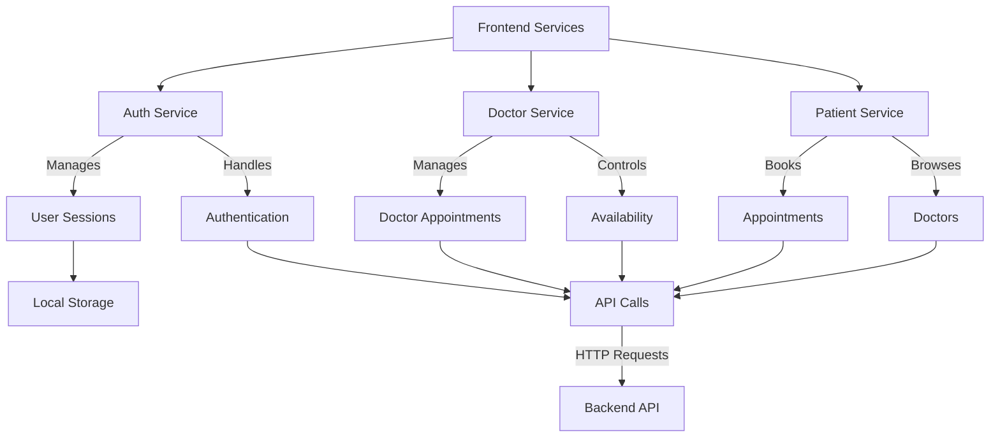
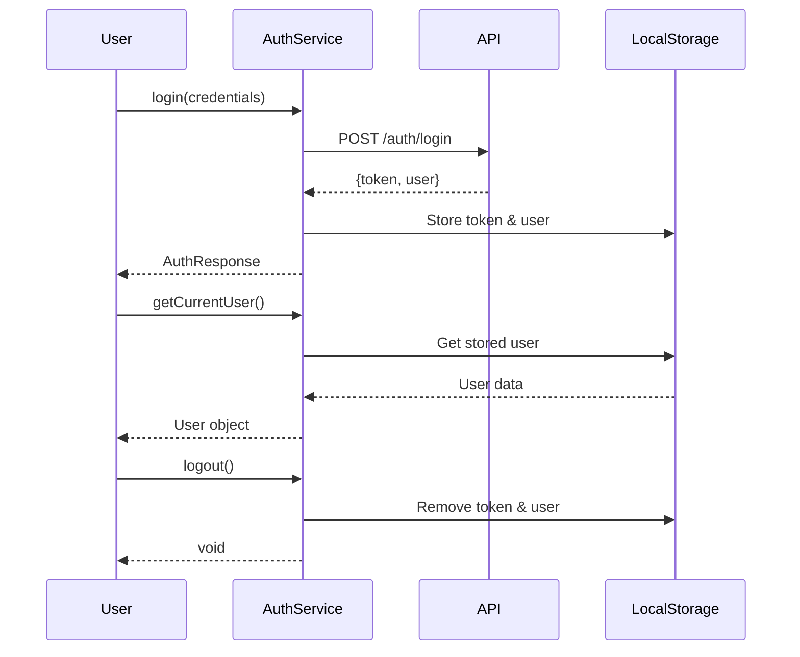

# Frontend API Documentation

This section documents the frontend service APIs for the Medical Appointment System.

## API Overview

The frontend services provide structured interfaces for:

- Authentication services (login, registration, user management)
- Doctor services (appointment management, availability management)
- Patient services (appointment booking, doctor discovery)

## Service Architecture



## Service Structure

The frontend services are organized into three main categories:

1. **Authentication Service**: Handles user authentication and session management
2. **Doctor Service**: Manages doctor-specific functionalities
3. **Patient Service**: Handles patient-specific functionalities

## Service Interfaces

### Authentication Service

Detailed documentation: [Auth Service](auth.md)

```typescript
interface authService {
  login(credentials: LoginRequest): Promise<AuthResponse>;
  register(data: RegisterRequest): Promise<AuthResponse>;
  logout(): void;
  getCurrentUser(): User | null;
  setAuthData(token: string, user: User): void;
}
```

### Doctor Service

Detailed documentation: [Doctor Service](doctor.md)

```typescript
interface doctorService {
  getAppointments(): Promise<Appointment[]>;
  getAvailability(): Promise<Availability[]>;
  getDoctorAvailability(doctorId: string): Promise<Availability[]>;
  setAvailability(availabilityData: AvailabilityRequest): Promise<Availability>;
  deleteAvailability(availabilityId: string): Promise<void>;
  updateAppointmentStatus(
    appointmentId: string,
    status: AppointmentStatus
  ): Promise<Appointment>;
}
```

### Patient Service

Detailed documentation: [Patient Service](patient.md)

```typescript
interface patientService {
  getAppointments(): Promise<Appointment[]>;
  scheduleAppointment(
    appointmentData: AppointmentRequest
  ): Promise<Appointment>;
  getDoctors(): Promise<Doctor[]>;
  getDoctorSlots(doctorId: string, date: string): Promise<string[]>;
}
```

## Error Handling

All service methods that make API calls return Promises and should be used with proper error handling:

```typescript
try {
  const data = await someService.someMethod();
  // Handle success
} catch (error) {
  // Handle error
  console.error("Error:", error);
}
```

## Authentication Flow


