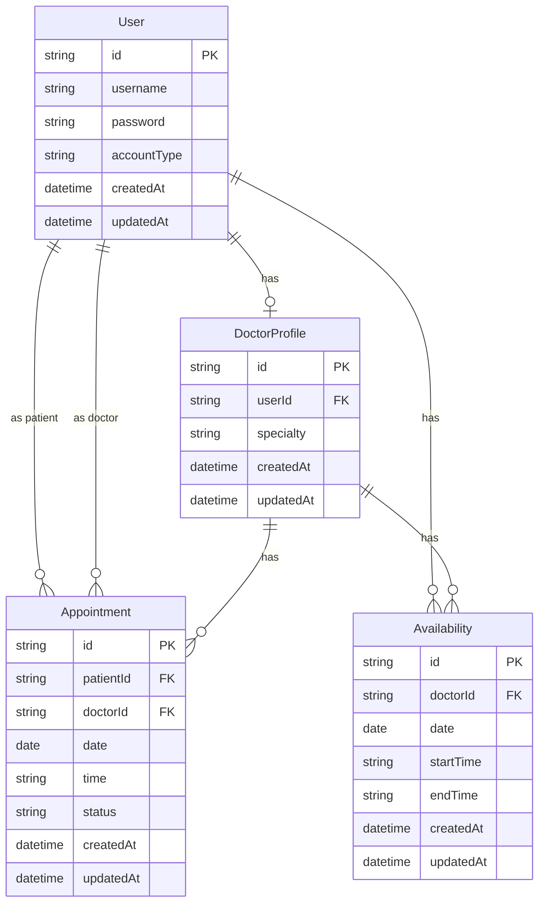

# Database Schema Documentation

This document provides detailed information about the database schema used in the Medical Appointment System.

## Overview

The Medical Appointment System uses PostgreSQL as its database and Prisma ORM for database access. The schema is designed to support the core functionality of scheduling and managing medical appointments between patients and doctors.

## Entity Relationship Diagram



## Tables

### User

Stores information about all users in the system, both patients and doctors.

| Column      | Type     | Description           | Constraints              |
| ----------- | -------- | --------------------- | ------------------------ |
| id          | String   | Unique identifier     | Primary Key              |
| username    | String   | User's username       | Unique, Not Null         |
| password    | String   | Hashed password       | Not Null                 |
| accountType | Enum     | PATIENT or DOCTOR     | Not Null                 |
| createdAt   | DateTime | Creation timestamp    | Not Null, Default: now() |
| updatedAt   | DateTime | Last update timestamp | Not Null, Default: now() |

### DoctorProfile

Contains additional information specific to doctors.

| Column    | Type     | Description           | Constraints              |
| --------- | -------- | --------------------- | ------------------------ |
| id        | String   | Unique identifier     | Primary Key              |
| userId    | String   | Reference to User     | Foreign Key, Unique      |
| specialty | String   | Medical specialty     | Not Null                 |
| createdAt | DateTime | Creation timestamp    | Not Null, Default: now() |
| updatedAt | DateTime | Last update timestamp | Not Null, Default: now() |

### Availability

Stores the time slots when doctors are available for appointments.

| Column    | Type     | Description                | Constraints              |
| --------- | -------- | -------------------------- | ------------------------ |
| id        | String   | Unique identifier          | Primary Key              |
| doctorId  | String   | Reference to User (doctor) | Foreign Key              |
| date      | Date     | Available date             | Not Null                 |
| startTime | String   | Start time (HH:MM)         | Not Null                 |
| endTime   | String   | End time (HH:MM)           | Not Null                 |
| createdAt | DateTime | Creation timestamp         | Not Null, Default: now() |
| updatedAt | DateTime | Last update timestamp      | Not Null, Default: now() |

### Appointment

Records scheduled appointments between patients and doctors.

| Column    | Type     | Description                              | Constraints                |
| --------- | -------- | ---------------------------------------- | -------------------------- |
| id        | String   | Unique identifier                        | Primary Key                |
| patientId | String   | Reference to User (patient)              | Foreign Key                |
| doctorId  | String   | Reference to User (doctor)               | Foreign Key                |
| date      | Date     | Appointment date                         | Not Null                   |
| time      | String   | Appointment time (HH:MM)                 | Not Null                   |
| status    | Enum     | PENDING, CONFIRMED, CANCELLED, COMPLETED | Not Null, Default: PENDING |
| createdAt | DateTime | Creation timestamp                       | Not Null, Default: now()   |
| updatedAt | DateTime | Last update timestamp                    | Not Null, Default: now()   |

## Relationships

1. **User to DoctorProfile**: One-to-one relationship. A User with accountType DOCTOR has one DoctorProfile.

   ```
   User 1--1 DoctorProfile
   ```

2. **User to Appointment (as patient)**: One-to-many relationship. A User with accountType PATIENT can have many Appointments.

   ```
   User 1--* Appointment (via patientId)
   ```

3. **User to Appointment (as doctor)**: One-to-many relationship. A User with accountType DOCTOR can have many Appointments.

   ```
   User 1--* Appointment (via doctorId)
   ```

4. **User to Availability**: One-to-many relationship. A User with accountType DOCTOR can have many Availability slots.
   ```
   User 1--* Availability
   ```

## Indexes

The following indexes are defined to optimize query performance:

1. **User.username**: Unique index for fast lookups by username
2. **Appointment.patientId**: Index for fast retrieval of a patient's appointments
3. **Appointment.doctorId**: Index for fast retrieval of a doctor's appointments
4. **Appointment.date**: Index for date-based appointment queries
5. **Availability.doctorId**: Index for fast retrieval of a doctor's availability
6. **Availability.date**: Index for date-based availability queries

## Enums

### AccountType

- `PATIENT`: Regular user who can book appointments
- `DOCTOR`: Medical professional who can set availability and manage appointments

### AppointmentStatus

- `PENDING`: Initial state when appointment is created
- `CONFIRMED`: Doctor has confirmed the appointment
- `CANCELLED`: Either party has cancelled the appointment
- `COMPLETED`: Appointment has taken place

## Prisma Schema

Below is the Prisma schema definition for the database:

```prisma
generator client {
  provider = "prisma-client-js"
}

datasource db {
  provider = "postgresql"
  url      = env("DATABASE_URL")
}

model User {
  id            String          @id @default(uuid())
  username      String          @unique
  password      String
  accountType   AccountType
  createdAt     DateTime        @default(now())
  updatedAt     DateTime        @updatedAt

  // Relations
  doctorProfile DoctorProfile?
  patientAppointments Appointment[] @relation("PatientAppointments")
  doctorAppointments  Appointment[] @relation("DoctorAppointments")
  availability  Availability[]
}

model DoctorProfile {
  id         String   @id @default(uuid())
  userId     String   @unique
  specialty  String
  createdAt  DateTime @default(now())
  updatedAt  DateTime @updatedAt

  // Relations
  user       User     @relation(fields: [userId], references: [id])
}

model Availability {
  id         String   @id @default(uuid())
  doctorId   String
  date       DateTime @db.Date
  startTime  String
  endTime    String
  createdAt  DateTime @default(now())
  updatedAt  DateTime @updatedAt

  // Relations
  doctor     User     @relation(fields: [doctorId], references: [id])

  @@index([doctorId])
  @@index([date])
}

model Appointment {
  id         String            @id @default(uuid())
  patientId  String
  doctorId   String
  date       DateTime          @db.Date
  time       String
  status     AppointmentStatus @default(PENDING)
  createdAt  DateTime          @default(now())
  updatedAt  DateTime          @updatedAt

  // Relations
  patient    User              @relation("PatientAppointments", fields: [patientId], references: [id])
  doctor     User              @relation("DoctorAppointments", fields: [doctorId], references: [id])

  @@index([patientId])
  @@index([doctorId])
  @@index([date])
}

enum AccountType {
  PATIENT
  DOCTOR
}

enum AppointmentStatus {
  PENDING
  CONFIRMED
  CANCELLED
  COMPLETED
}
```

## Data Validation

The following validation rules are enforced at the database level:

1. Username must be unique across all users
2. A doctor can only have one profile
3. Time values are stored as strings in the format "HH:MM"
4. Dates are stored in ISO format (YYYY-MM-DD)
5. Appointment status must be one of the defined enum values
6. Account type must be one of the defined enum values

## Migrations

Database migrations are managed through Prisma Migrate. To create a new migration after schema changes:

```bash
npx prisma migrate dev --name migration_name
```

To apply migrations in production:

```bash
npx prisma migrate deploy
```

## Seeding

The database can be seeded with initial data using the Prisma seed functionality. The seed script creates:

1. Sample doctor accounts with specialties
2. Sample patient accounts
3. Initial availability for doctors
4. Sample appointments

To run the seed script:

```bash
npx prisma db seed
```
