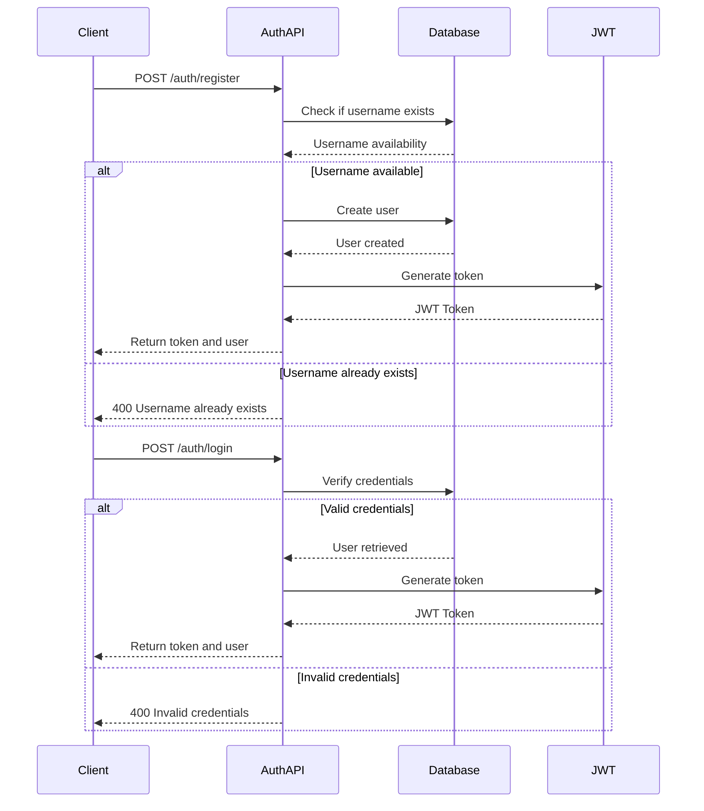

# Authentication API

The Authentication API provides endpoints for user registration and login functionalities.

## Endpoints

### Register User

Creates a new user account (patient or doctor) and returns a JWT token.

**URL**: `/api/auth/register`

**Method**: `POST`

**Auth required**: No

**Request body**:

```json
{
  "username": "string",
  "password": "string",
  "type": "patient|doctor",
  "specialty": "string" // Required only if type is "doctor"
}
```

**Success Response**:

- **Code**: 201 Created
- **Content**:
  ```json
  {
    "token": "string",
    "user": {
      "id": "string",
      "username": "string",
      "type": "patient|doctor",
      "doctorProfile": {
        "id": "string",
        "specialty": "string"
      } // Only included if type is "doctor"
    }
  }
  ```

**Error Responses**:

- **Code**: 400 Bad Request
  - **Content**: `{ "errors": [{ "msg": "Username already exists" }] }`
  - **Content**: `{ "errors": [{ "msg": "Password must be at least 6 characters" }] }`
  - **Content**: `{ "errors": [{ "msg": "Type must be either patient or doctor" }] }`
  - **Content**: `{ "errors": [{ "msg": "Specialty is required for doctor accounts" }] }`

### Login User

Authenticates a user and returns a JWT token.

**URL**: `/api/auth/login`

**Method**: `POST`

**Auth required**: No

**Request body**:

```json
{
  "username": "string",
  "password": "string"
}
```

**Success Response**:

- **Code**: 200 OK
- **Content**:
  ```json
  {
    "token": "string",
    "user": {
      "id": "string",
      "username": "string",
      "type": "patient|doctor",
      "doctorProfile": {
        "id": "string",
        "specialty": "string"
      } // Only included if type is "doctor"
    }
  }
  ```

**Error Responses**:

- **Code**: 400 Bad Request
  - **Content**: `{ "errors": [{ "msg": "Invalid credentials" }] }`
  - **Content**: `{ "errors": [{ "msg": "Username is required" }] }`
  - **Content**: `{ "errors": [{ "msg": "Password is required" }] }`

## JWT Token

The JWT token returned from login and register endpoints should be included in the `Authorization` header for all protected routes:

```
Authorization: Bearer <token>
```

## Authentication Flow



## Password Security

Passwords are hashed using bcrypt before being stored in the database. The original password is never stored or transmitted in plain text after initial submission.
