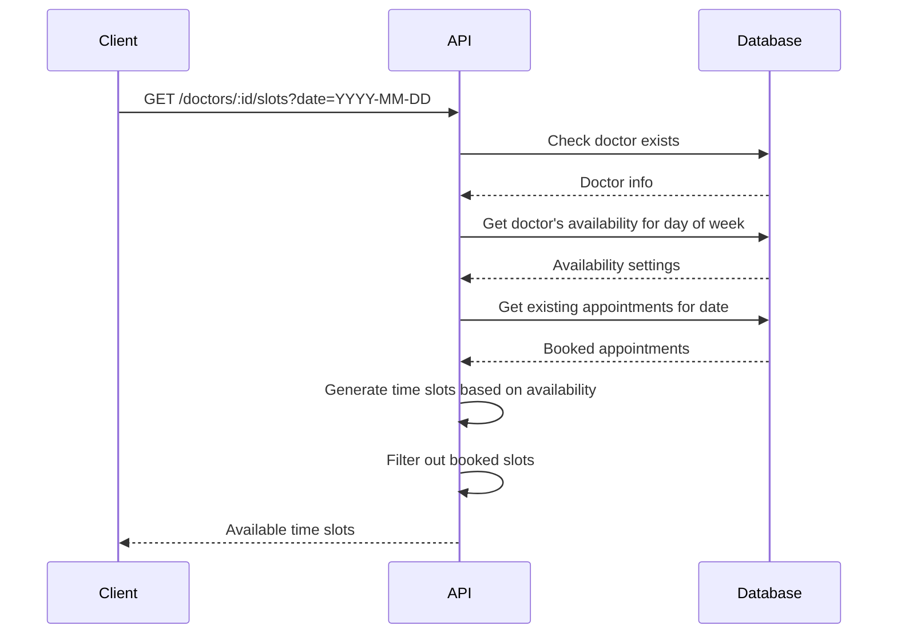

# Doctor API

The Doctor API provides endpoints for managing doctor-specific functionalities, including appointment management and availability settings.

## Appointments

### Get Doctor's Appointments

Retrieves all appointments for the authenticated doctor.

**URL**: `/api/doctors/appointments`

**Method**: `GET`

**Auth required**: Yes (Doctor role)

**Success Response**:

- **Code**: 200 OK
- **Content**:
  ```json
  [
    {
      "id": "string",
      "patientId": "string",
      "doctorId": "string",
      "patientName": "string",
      "doctorName": "string",
      "dateTime": "2023-06-01T10:00:00Z",
      "status": "scheduled|completed|cancelled",
      "createdAt": "2023-05-25T14:32:21Z",
      "updatedAt": "2023-05-25T14:32:21Z"
    }
  ]
  ```

**Error Responses**:

- **Code**: 401 Unauthorized
  - **Content**: `{ "message": "Not authenticated" }`
- **Code**: 403 Forbidden
  - **Content**: `{ "message": "Not authorized. Doctors only." }`

### Update Appointment Status

Updates the status of a specific appointment.

**URL**: `/api/doctors/appointments/:id/status`

**Method**: `PATCH`

**Auth required**: Yes (Doctor role)

**URL Parameters**:

- `id`: Appointment ID

**Request body**:

```json
{
  "status": "completed|cancelled"
}
```

**Success Response**:

- **Code**: 200 OK
- **Content**:
  ```json
  {
    "id": "string",
    "patientId": "string",
    "doctorId": "string",
    "patientName": "string",
    "doctorName": "string",
    "dateTime": "2023-06-01T10:00:00Z",
    "status": "completed|cancelled",
    "createdAt": "2023-05-25T14:32:21Z",
    "updatedAt": "2023-05-25T15:45:33Z"
  }
  ```

**Error Responses**:

- **Code**: 400 Bad Request
  - **Content**: `{ "message": "Invalid status. Must be completed or cancelled." }`
- **Code**: 401 Unauthorized
  - **Content**: `{ "message": "Not authenticated" }`
- **Code**: 403 Forbidden
  - **Content**: `{ "message": "Not authorized. Doctors only." }`
  - **Content**: `{ "message": "Not authorized to update this appointment" }`
- **Code**: 404 Not Found
  - **Content**: `{ "message": "Appointment not found" }`

## Availability

### Get Doctor's Availability

Retrieves the availability settings for the authenticated doctor.

**URL**: `/api/doctors/availability`

**Method**: `GET`

**Auth required**: Yes (Doctor role)

**Success Response**:

- **Code**: 200 OK
- **Content**:
  ```json
  [
    {
      "id": "string",
      "doctorId": "string",
      "dayOfWeek": 1, // 0 = Sunday, 6 = Saturday
      "startTime": "09:00",
      "endTime": "17:00",
      "createdAt": "2023-05-20T10:15:33Z",
      "updatedAt": "2023-05-20T10:15:33Z"
    }
  ]
  ```

**Error Responses**:

- **Code**: 401 Unauthorized
  - **Content**: `{ "message": "Not authenticated" }`
- **Code**: 403 Forbidden
  - **Content**: `{ "message": "Not authorized. Doctors only." }`

### Set Doctor's Availability

Creates a new availability slot for the authenticated doctor.

**URL**: `/api/doctors/availability`

**Method**: `POST`

**Auth required**: Yes (Doctor role)

**Request body**:

```json
{
  "dayOfWeek": 1, // 0 = Sunday, 6 = Saturday
  "startTime": "09:00",
  "endTime": "17:00"
}
```

**Success Response**:

- **Code**: 201 Created
- **Content**:
  ```json
  {
    "id": "string",
    "doctorId": "string",
    "dayOfWeek": 1,
    "startTime": "09:00",
    "endTime": "17:00",
    "createdAt": "2023-05-25T15:45:33Z",
    "updatedAt": "2023-05-25T15:45:33Z"
  }
  ```

**Error Responses**:

- **Code**: 400 Bad Request
  - **Content**: `{ "errors": [{ "msg": "Day of week must be between 0 and 6" }] }`
  - **Content**: `{ "errors": [{ "msg": "Start time must be in HH:mm format" }] }`
  - **Content**: `{ "errors": [{ "msg": "End time must be in HH:mm format" }] }`
  - **Content**: `{ "message": "Overlapping availability exists" }`
- **Code**: 401 Unauthorized
  - **Content**: `{ "message": "Not authenticated" }`
- **Code**: 403 Forbidden
  - **Content**: `{ "message": "Not authorized. Doctors only." }`

### Delete Availability Slot

Deletes a specific availability slot.

**URL**: `/api/doctors/availability/:id`

**Method**: `DELETE`

**Auth required**: Yes (Doctor role)

**URL Parameters**:

- `id`: Availability ID

**Success Response**:

- **Code**: 200 OK
- **Content**:
  ```json
  {
    "message": "Availability deleted successfully"
  }
  ```

**Error Responses**:

- **Code**: 401 Unauthorized
  - **Content**: `{ "message": "Not authenticated" }`
- **Code**: 403 Forbidden
  - **Content**: `{ "message": "Not authorized. Doctors only." }`
  - **Content**: `{ "message": "Not authorized to delete this availability" }`
- **Code**: 404 Not Found
  - **Content**: `{ "message": "Availability not found" }`

### Get Doctor's Available Time Slots

Retrieves available time slots for a specific doctor on a given date.

**URL**: `/api/doctors/:id/slots`

**Method**: `GET`

**Auth required**: Yes

**URL Parameters**:

- `id`: Doctor ID

**Query Parameters**:

- `date`: Date in YYYY-MM-DD format

**Success Response**:

- **Code**: 200 OK
- **Content**:
  ```json
  [
    "09:00",
    "09:30",
    "10:00",
    "10:30"
    // Additional time slots...
  ]
  ```

**Error Responses**:

- **Code**: 400 Bad Request
  - **Content**: `{ "message": "Invalid date format. Use YYYY-MM-DD" }`
- **Code**: 401 Unauthorized
  - **Content**: `{ "message": "Not authenticated" }`
- **Code**: 404 Not Found
  - **Content**: `{ "message": "Doctor not found" }`
  - **Content**: `{ "message": "No availability found for this day" }`

## Available Slots Flow


