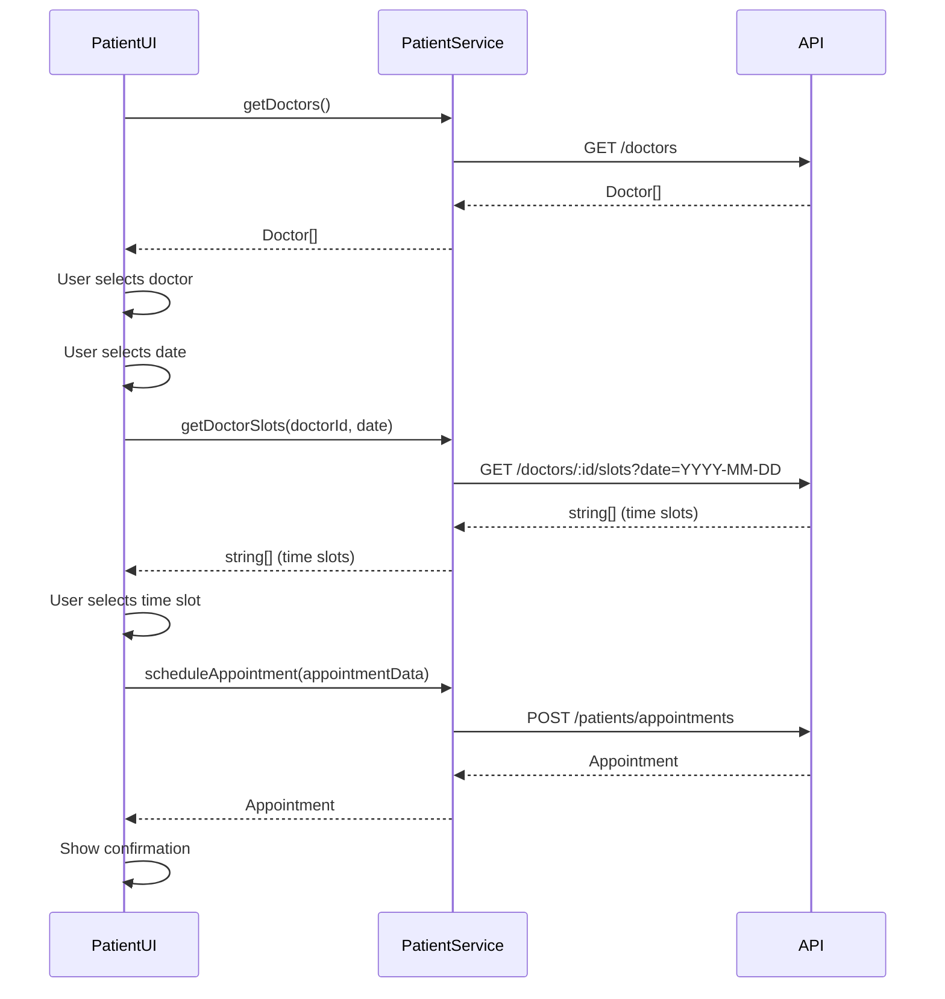
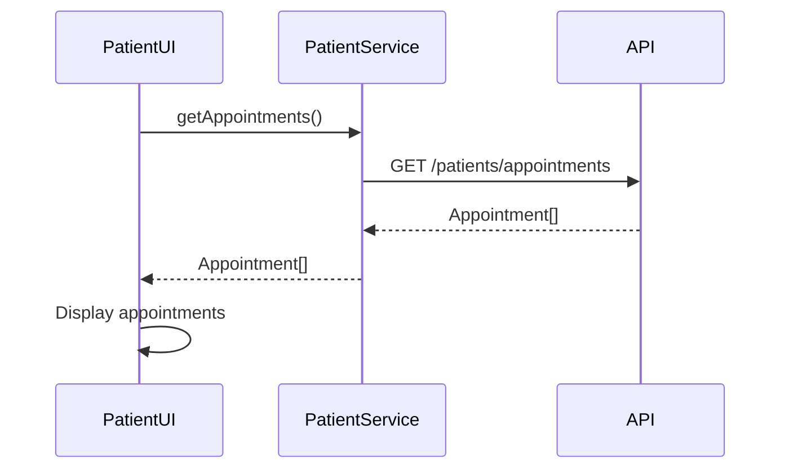

# Patient Service Documentation

The Patient Service provides the frontend functionality for patient-specific operations, including appointment scheduling and doctor discovery.

## Overview

The Patient Service is responsible for:

1. Retrieving patient appointments
2. Scheduling new appointments
3. Retrieving available doctors
4. Getting available time slots for a specific doctor and date

## Service Interface

```typescript
interface patientService {
  getAppointments(): Promise<Appointment[]>;
  scheduleAppointment(
    appointmentData: AppointmentRequest
  ): Promise<Appointment>;
  getDoctors(): Promise<Doctor[]>;
  getDoctorSlots(doctorId: string, date: string): Promise<string[]>;
}
```

## Types

### Appointment

```typescript
interface Appointment {
  id: string;
  patientId: string;
  doctorId: string;
  patientName: string;
  doctorName: string;
  doctorSpecialty: string;
  dateTime: string; // ISO date string
  status: AppointmentStatus;
  createdAt: string;
  updatedAt: string;
}
```

### AppointmentRequest

```typescript
interface AppointmentRequest {
  doctorId: string;
  dateTime: string; // ISO date string
}
```

### AppointmentStatus

```typescript
type AppointmentStatus = "scheduled" | "completed" | "cancelled";
```

### Doctor

```typescript
interface Doctor {
  id: string;
  username: string;
  doctorProfile: {
    id: string;
    specialty: string;
  };
}
```

## Methods

### getAppointments

Retrieves all appointments for the authenticated patient.

```typescript
async getAppointments(): Promise<Appointment[]>
```

**Returns**:

- Promise resolving to an array of Appointment objects

**Throws**:

- Error if the request fails

**Example**:

```typescript
try {
  const appointments = await patientService.getAppointments();

  // Handle appointments
  console.log(`Retrieved ${appointments.length} appointments`);
} catch (error) {
  // Handle error
  console.error("Failed to fetch appointments:", error);
}
```

### scheduleAppointment

Creates a new appointment for the authenticated patient.

```typescript
async scheduleAppointment(appointmentData: AppointmentRequest): Promise<Appointment>
```

**Parameters**:

- `appointmentData`: Object containing the doctor ID and appointment date/time

**Returns**:

- Promise resolving to the created Appointment object

**Throws**:

- Error if the request fails

**Example**:

```typescript
try {
  const appointmentData = {
    doctorId: "123",
    dateTime: "2023-06-15T14:30:00Z",
  };

  const newAppointment = await patientService.scheduleAppointment(
    appointmentData
  );

  // Handle new appointment
  console.log(`Created new appointment with ID: ${newAppointment.id}`);
} catch (error) {
  // Handle error
  console.error("Failed to schedule appointment:", error);
}
```

### getDoctors

Retrieves a list of all available doctors.

```typescript
async getDoctors(): Promise<Doctor[]>
```

**Returns**:

- Promise resolving to an array of Doctor objects

**Throws**:

- Error if the request fails

**Example**:

```typescript
try {
  const doctors = await patientService.getDoctors();

  // Handle doctors list
  console.log(`Retrieved ${doctors.length} doctors`);
} catch (error) {
  // Handle error
  console.error("Failed to fetch doctors:", error);
}
```

### getDoctorSlots

Retrieves available time slots for a specific doctor on a given date.

```typescript
async getDoctorSlots(doctorId: string, date: string): Promise<string[]>
```

**Parameters**:

- `doctorId`: ID of the doctor to retrieve time slots for
- `date`: Date in YYYY-MM-DD format

**Returns**:

- Promise resolving to an array of available time slots (in "HH:mm" format)

**Throws**:

- Error if the request fails

**Example**:

```typescript
try {
  const doctorId = "123";
  const date = "2023-06-15";

  const timeSlots = await patientService.getDoctorSlots(doctorId, date);

  // Handle time slots
  console.log(
    `Retrieved ${timeSlots.length} available time slots for doctor ${doctorId} on ${date}`
  );

  // Example slots: ["09:00", "09:30", "10:00", ...]
} catch (error) {
  // Handle error
  console.error(
    `Failed to fetch time slots for doctor ${doctorId} on ${date}:`,
    error
  );
}
```

## Appointment Scheduling Flow



## Patient Appointments Management Flow



## Usage with React Components

The Patient Service is typically used within React functional components for appointment scheduling:

```tsx
import { useEffect, useState } from "react";
import { patientService } from "../services/patient/patient.service";
import { Doctor } from "../types/doctor";
import { format } from "date-fns";

const AppointmentScheduler: React.FC = () => {
  const [doctors, setDoctors] = useState<Doctor[]>([]);
  const [selectedDoctor, setSelectedDoctor] = useState<string | null>(null);
  const [selectedDate, setSelectedDate] = useState<Date | null>(null);
  const [availableTimeSlots, setAvailableTimeSlots] = useState<string[]>([]);
  const [selectedTime, setSelectedTime] = useState<string | null>(null);
  const [loading, setLoading] = useState<boolean>(false);
  const [error, setError] = useState<string | null>(null);

  useEffect(() => {
    const fetchDoctors = async () => {
      try {
        setLoading(true);
        const fetchedDoctors = await patientService.getDoctors();
        setDoctors(fetchedDoctors);
        setError(null);
      } catch (err) {
        setError("Failed to fetch doctors");
        console.error(err);
      } finally {
        setLoading(false);
      }
    };

    fetchDoctors();
  }, []);

  useEffect(() => {
    const fetchTimeSlots = async () => {
      if (selectedDoctor && selectedDate) {
        try {
          setLoading(true);
          const formattedDate = format(selectedDate, "yyyy-MM-dd");
          const slots = await patientService.getDoctorSlots(
            selectedDoctor,
            formattedDate
          );
          setAvailableTimeSlots(slots);
          setError(null);
        } catch (err) {
          setError("Failed to fetch available time slots");
          console.error(err);
        } finally {
          setLoading(false);
        }
      }
    };

    fetchTimeSlots();
  }, [selectedDoctor, selectedDate]);

  const handleScheduleAppointment = async () => {
    if (selectedDoctor && selectedDate && selectedTime) {
      try {
        setLoading(true);

        // Combine date and time
        const appointmentDateTime = new Date(selectedDate);
        const [hours, minutes] = selectedTime.split(":").map(Number);
        appointmentDateTime.setHours(hours, minutes, 0, 0);

        const appointmentData = {
          doctorId: selectedDoctor,
          dateTime: appointmentDateTime.toISOString(),
        };

        const newAppointment = await patientService.scheduleAppointment(
          appointmentData
        );

        // Handle successful appointment creation
        console.log("Appointment scheduled:", newAppointment);
        setError(null);

        // Reset form or navigate to confirmation
      } catch (err) {
        setError("Failed to schedule appointment");
        console.error(err);
      } finally {
        setLoading(false);
      }
    }
  };

  // Component rendering logic...
};
```
