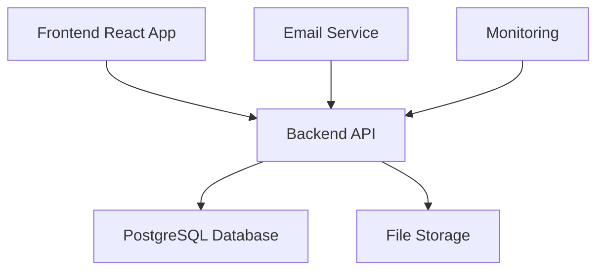
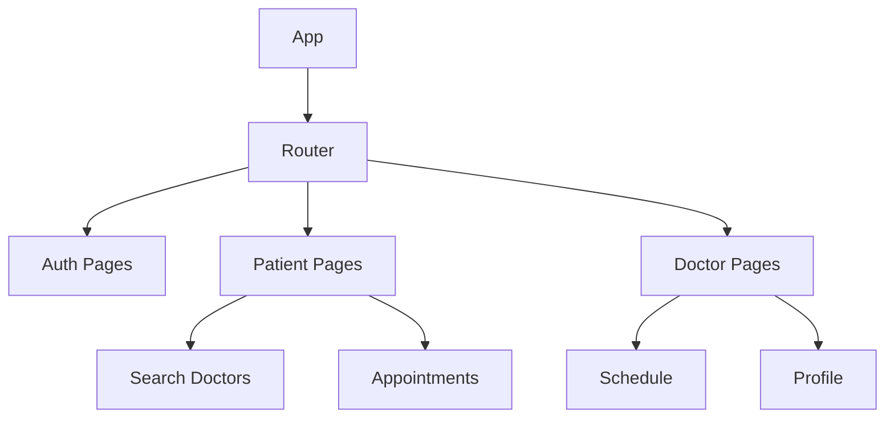
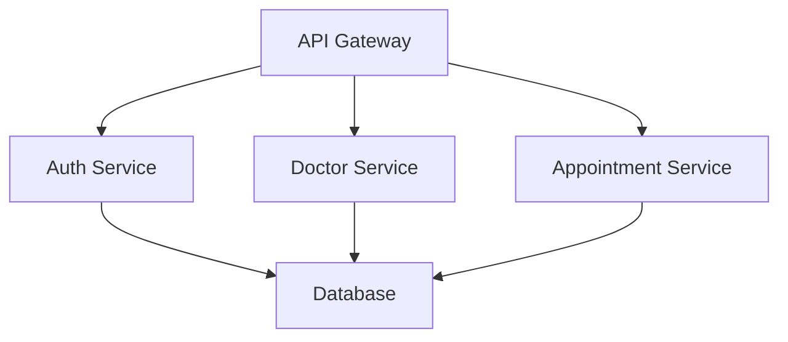
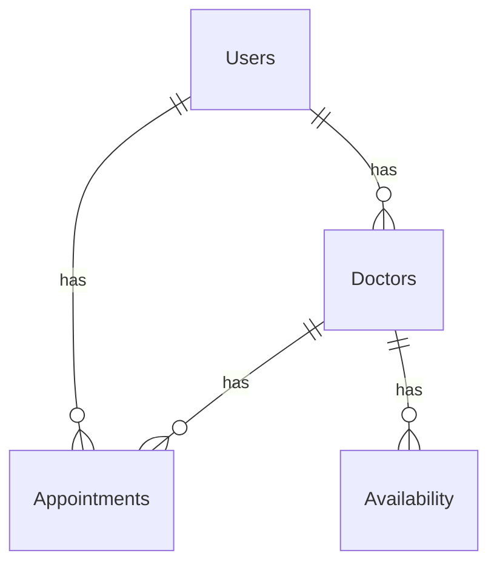
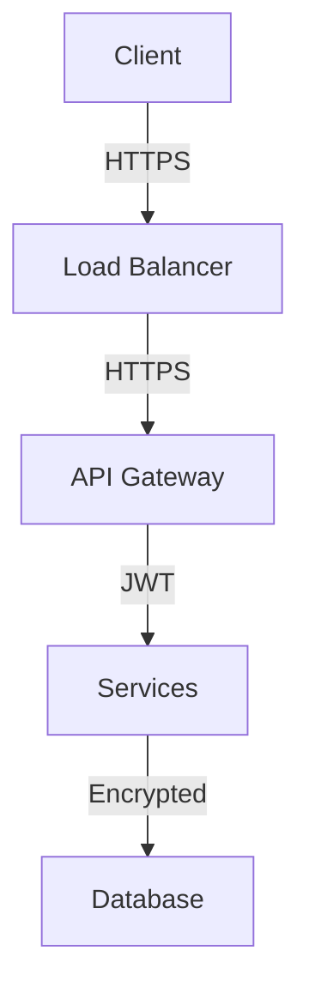
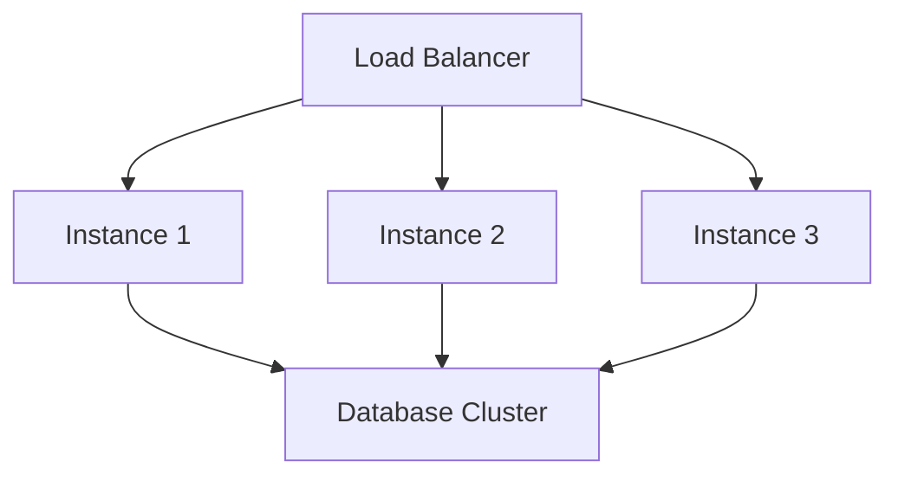
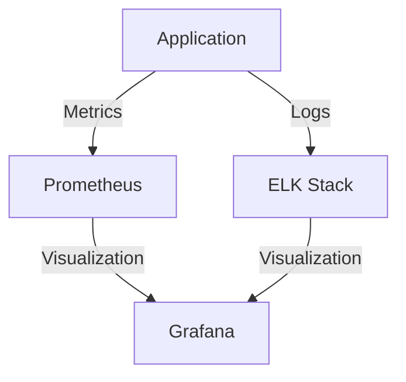
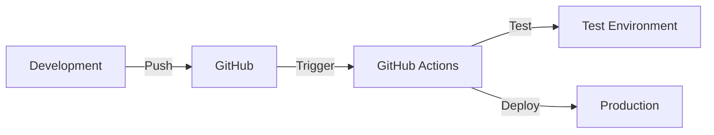
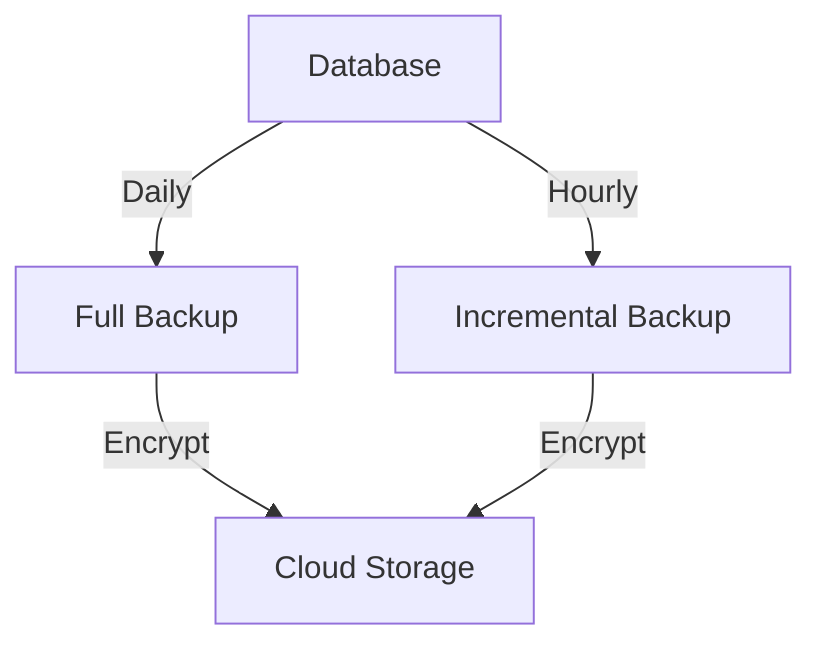
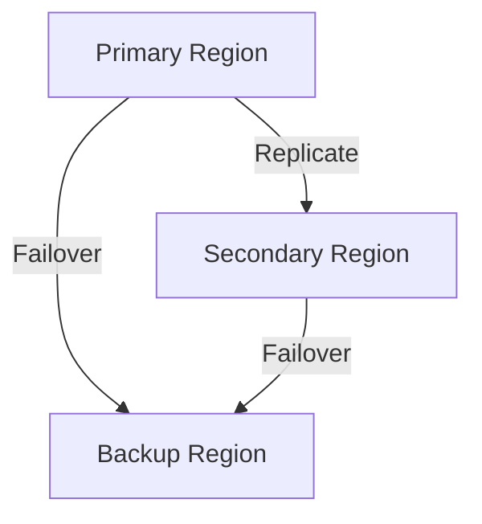

# Архитектура на Системата

## Общ Преглед

Този документ описва архитектурата на Системата за Медицински Прегледи. Системата е проектирана като модерно уеб приложение с разделена архитектура, състояща се от frontend и backend компоненти.

## Системна Архитектура

### Компоненти


#### Описание
- **Frontend**: React приложение с TypeScript
- **Backend**: Node.js API с Express
- **База Данни**: PostgreSQL
- **Файлово Съхранение**: AWS S3
- **Email Служба**: SendGrid
- **Мониторинг**: Prometheus & Grafana

## Frontend Архитектура

### Структура на Компонентите


#### Описание
- Модулна структура
- Разделение по роли
- Преизползваеми компоненти
- Централизирано управление на състоянието

### Технологичен Стек
```typescript
// package.json
{
  "dependencies": {
    "react": "^18.2.0",
    "react-dom": "^18.2.0",
    "react-router-dom": "^6.x",
    "@mui/material": "^5.x",
    "@emotion/react": "^11.x",
    "@emotion/styled": "^11.x",
    "axios": "^1.x",
    "date-fns": "^2.x"
  }
}
```

## Backend Архитектура

### Структура на API


#### Описание
- RESTful API дизайн
- Модулни услуги
- Централизирана автентикация
- Разделена бизнес логика

### Технологичен Стек
```typescript
// package.json
{
  "dependencies": {
    "express": "^4.x",
    "typeorm": "^0.3.x",
    "pg": "^8.x",
    "jsonwebtoken": "^9.x",
    "bcrypt": "^5.x",
    "joi": "^17.x",
    "winston": "^3.x"
  }
}
```

## База Данни

### Схема на Базата Данни


#### Описание
- Нормализирана структура
- Оптимизирани индекси
- Релационни връзки
- Типизирани данни

## Сигурност

### Архитектура на Сигурността


#### Описание
- SSL/TLS криптиране
- JWT автентикация
- Rate limiting
- CORS защита

## Масштабируемост

### Хоризонтално Мащабиране


#### Описание
- Балансиране на натоварването
- Репликация на базата данни
- Кеширане
- CDN интеграция

## Мониторинг

### Архитектура на Мониторинга


#### Описание
- Събиране на метрики
- Логване
- Визуализация
- Известяване

## CI/CD

### Процес на Разработка


#### Описание
- Автоматизирано тестване
- Непрекъснато интегриране
- Автоматично разгръщане
- Версиониране

## Резервни Копия

### Стратегия за Резервни Копия


#### Описание
- Редовни резервни копия
- Криптиране
- Географско разпространение
- Възстановяване

## Отказоустойчивост

### Архитектура на Отказоустойчивостта


#### Описание
- Регионална репликация
- Автоматично превключване
- Възстановяване при отказ
- Географско разпространение

## Бележки за Имплементацията

### Добри Практики
- Модулна архитектура
- Чист код
- SOLID принципи
- DRY принцип
- KISS принцип

### Производителност
- Оптимизация на заявки
- Кеширане
- Лениво зареждане
- Компресия

### Поддръжка
- Документация
- Тестове
- Логване
- Мониторинг 