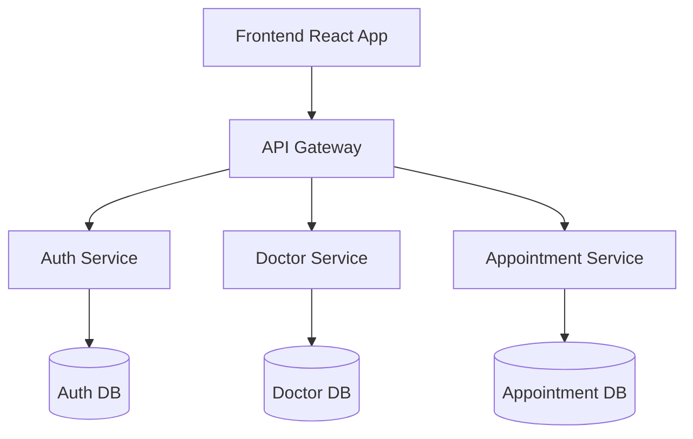
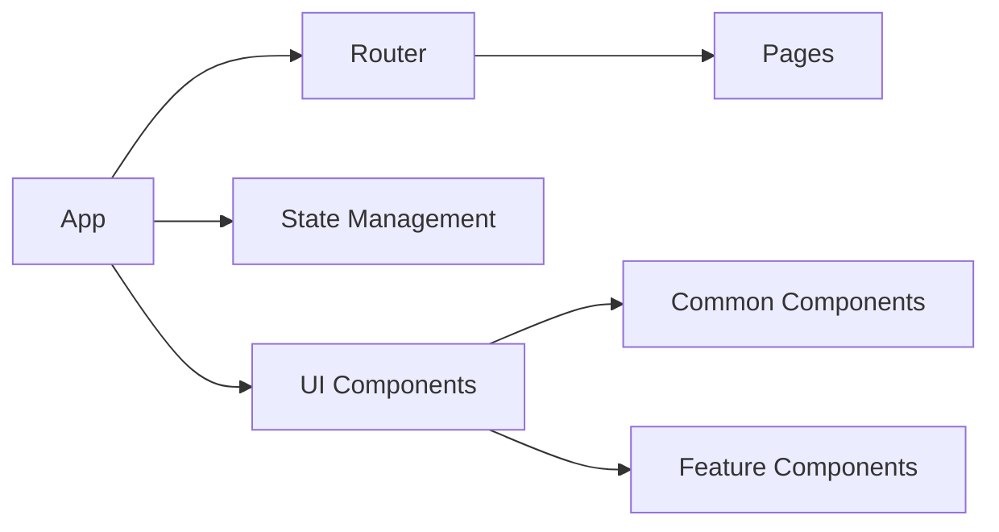
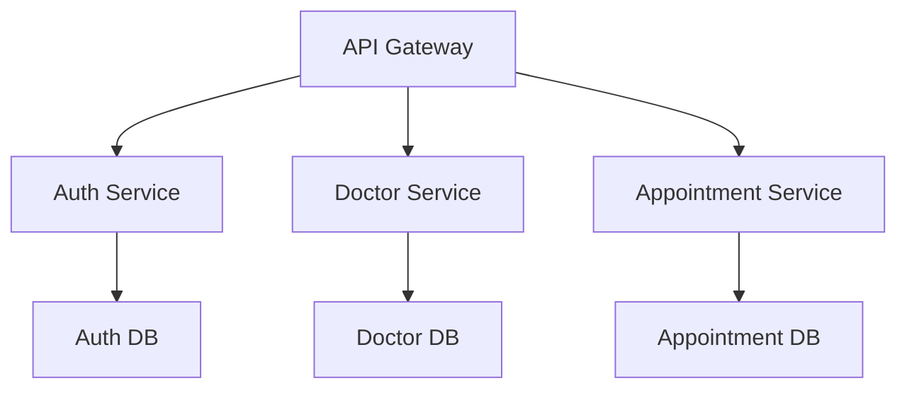
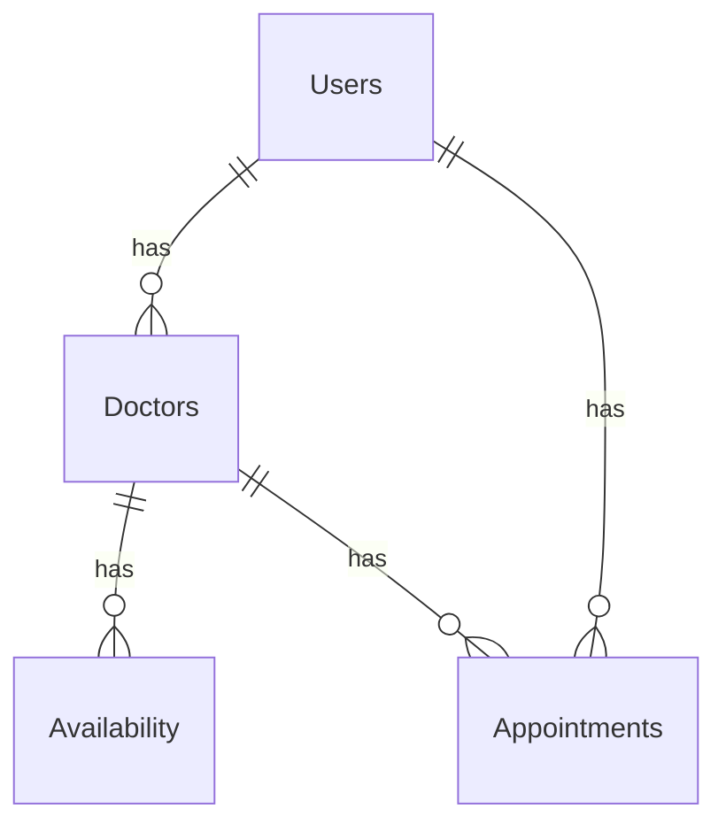
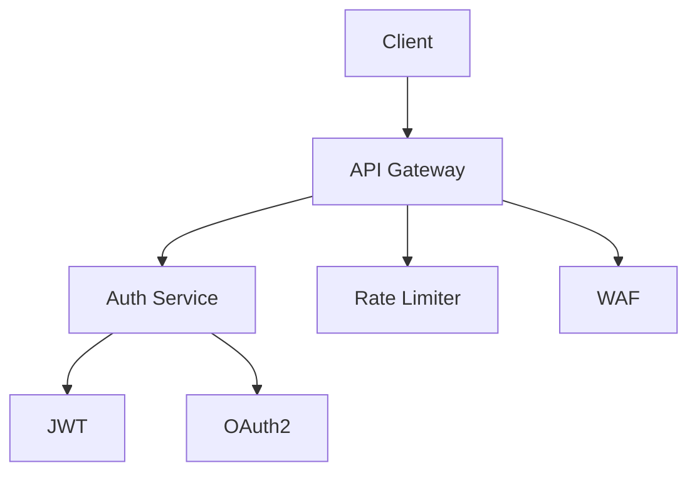
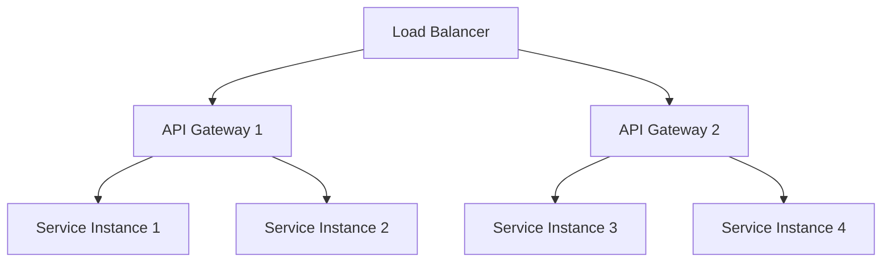
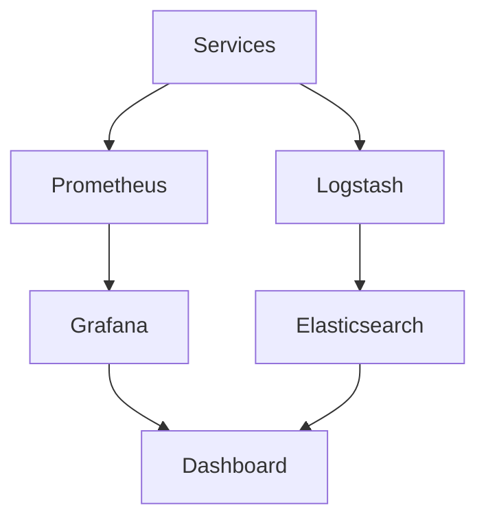
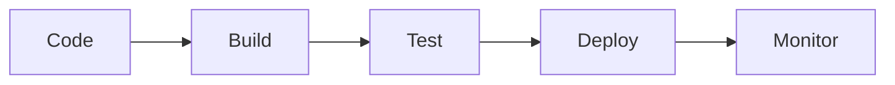
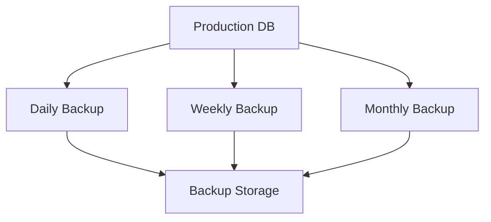
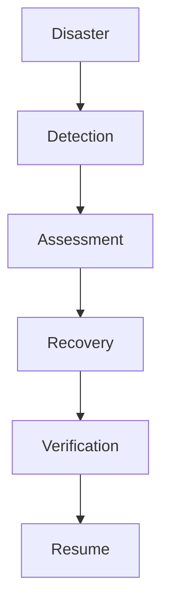

# Архитектура на Системата

## Общ Преглед

Системата за Медицински Прегледи е построена с използване на модерна микросервизна архитектура, която позволява висока скалируемост и поддръжка. Системата се състои от следните основни компоненти:

## Frontend Архитектура

### Компоненти

### Технологии
- React 18
- TypeScript
- Material-UI
- Redux Toolkit
- React Router v6

## Backend Архитектура

### Микросервиси

### Технологии
- Node.js
- Express
- TypeScript
- PostgreSQL
- Redis

## База Данни

### Схема

### Технологии
- PostgreSQL 14
- Redis (кеширане)
- TypeORM

## Сигурност

### Архитектура

### Технологии
- JWT
- OAuth2
- Rate Limiting
- WAF (Web Application Firewall)

## Скалируемост

### Хоризонтално Мащабиране

### Технологии
- Docker
- Kubernetes
- Nginx
- Redis Cluster

## Мониторинг

### Архитектура

### Технологии
- Prometheus
- Grafana
- ELK Stack
- Sentry

## CI/CD Процес

### Пайплайн

### Технологии
- GitHub Actions
- Docker
- Kubernetes
- ArgoCD

## Резервни Копия

### Стратегия

### Технологии
- pg_dump
- AWS S3
- Glacier
- Backup Rotation

## Възстановяване при Катастрофа

### Процес

### Технологии
- AWS DR
- Multi-region
- Failover
- Backup Restore

## Имплементационни Забележки

### Добри Практики
1. Използвайте контейнеризация за всички услуги
2. Имплементирайте circuit breakers
3. Използвайте retry механизми
4. Приложете rate limiting
5. Имплементирайте proper logging

### Оптимизации
1. Кеширайте често използвани данни
2. Използвайте connection pooling
3. Имплементирайте lazy loading
4. Оптимизирайте заявките към базата данни
5. Използвайте CDN за статични файлове

### Поддръжка
1. Редовни security updates
2. Мониторинг на производителността
3. Автоматизирани тестове
4. Документация
5. Code reviews 