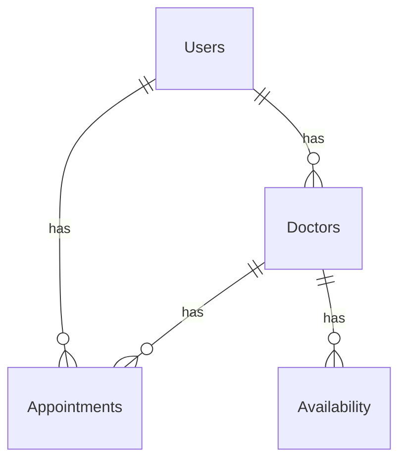

# Схема на Базата Данни

## Общ Преглед

Този документ описва структурата на базата данни на Системата за Медицински Прегледи. Базата данни е проектирана с PostgreSQL и включва таблици за потребители, лекари, наличност и прегледи.

## Таблици

### Потребители
```sql
CREATE TABLE users (
    id SERIAL PRIMARY KEY,
    username VARCHAR(50) UNIQUE NOT NULL,
    password VARCHAR(255) NOT NULL,
    email VARCHAR(100) UNIQUE NOT NULL,
    type VARCHAR(20) NOT NULL CHECK (type IN ('patient', 'doctor')),
    created_at TIMESTAMP DEFAULT CURRENT_TIMESTAMP,
    updated_at TIMESTAMP DEFAULT CURRENT_TIMESTAMP
);
```

#### Описание
- Основна таблица за потребители
- Уникални потребителски имена
- Криптирани пароли
- Тип на потребителя

### Лекари
```sql
CREATE TABLE doctors (
    id SERIAL PRIMARY KEY,
    user_id INTEGER REFERENCES users(id),
    name VARCHAR(100) NOT NULL,
    specialty VARCHAR(100) NOT NULL,
    education TEXT,
    qualifications TEXT,
    contact_info JSONB,
    location VARCHAR(255),
    languages TEXT[],
    profile_photo_url VARCHAR(255),
    description TEXT,
    created_at TIMESTAMP DEFAULT CURRENT_TIMESTAMP,
    updated_at TIMESTAMP DEFAULT CURRENT_TIMESTAMP
);
```

#### Описание
- Профилна информация за лекари
- Специализации
- Образование и квалификации
- Контактна информация

### Наличност
```sql
CREATE TABLE availability (
    id SERIAL PRIMARY KEY,
    doctor_id INTEGER REFERENCES doctors(id),
    day_of_week INTEGER CHECK (day_of_week BETWEEN 0 AND 6),
    start_time TIME NOT NULL,
    end_time TIME NOT NULL,
    is_available BOOLEAN DEFAULT true,
    created_at TIMESTAMP DEFAULT CURRENT_TIMESTAMP,
    updated_at TIMESTAMP DEFAULT CURRENT_TIMESTAMP
);
```

#### Описание
- График на наличност
- Работни часове
- Дни от седмицата
- Статус на наличност

### Прегледи
```sql
CREATE TABLE appointments (
    id SERIAL PRIMARY KEY,
    doctor_id INTEGER REFERENCES doctors(id),
    patient_id INTEGER REFERENCES users(id),
    date DATE NOT NULL,
    time TIME NOT NULL,
    status VARCHAR(20) NOT NULL CHECK (status IN ('scheduled', 'completed', 'cancelled')),
    notes TEXT,
    created_at TIMESTAMP DEFAULT CURRENT_TIMESTAMP,
    updated_at TIMESTAMP DEFAULT CURRENT_TIMESTAMP
);
```

#### Описание
- Запазени прегледи
- Статус на прегледа
- Бележки
- История на промените

## Индекси

### Търсене на Лекари
```sql
CREATE INDEX idx_doctors_specialty ON doctors(specialty);
CREATE INDEX idx_doctors_location ON doctors(location);
```

#### Описание
- Оптимизация на търсене
- Филтриране по специалност
- Филтриране по локация
- Подобрена производителност

### Търсене на Прегледи
```sql
CREATE INDEX idx_appointments_date ON appointments(date);
CREATE INDEX idx_appointments_status ON appointments(status);
```

#### Описание
- Оптимизация на заявки
- Филтриране по дата
- Филтриране по статус
- Подобрена производителност

## Релации

### ERD Диаграма


#### Описание
- Един към много релации
- Връзки между таблици
- Референтна цялостност
- Каскадни операции

## Бележки за Имплементацията

### Типове Данни
- SERIAL за ID полета
- VARCHAR за текст с ограничена дължина
- TEXT за дълъг текст
- TIMESTAMP за дати и времена
- JSONB за структурирани данни
- TEXT[] за масиви

### Ограничения
- Връзки с външни ключове
- Проверки на стойностите
- Уникални стойности
- NOT NULL ограничения

### Безопасност
- Криптиране на пароли
- Валидация на данни
- Регулиран достъп
- Аудит логове

### Поддръжка
- Редовни резервни копия
- Оптимизация на индекси
- Мониторинг на производителността
- Възстановяване при отказ 