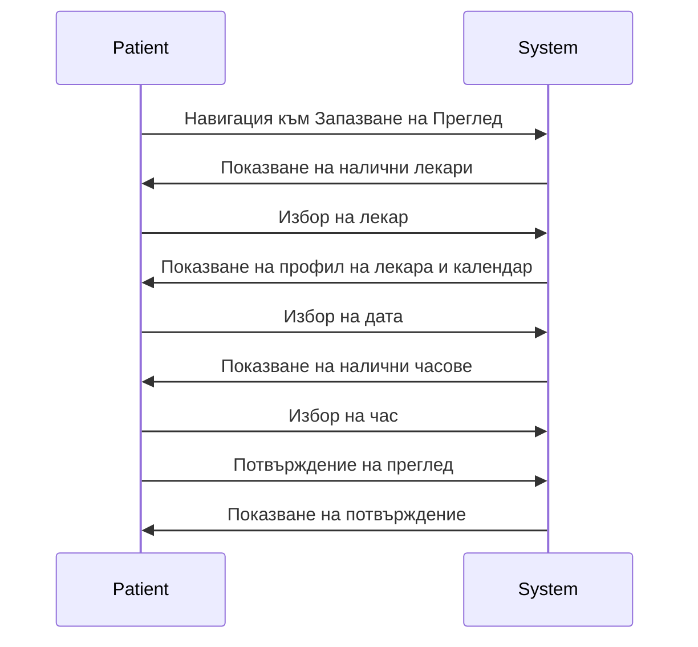
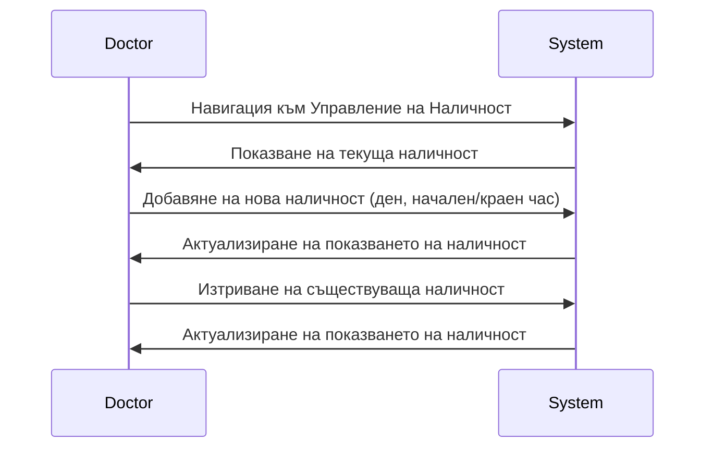
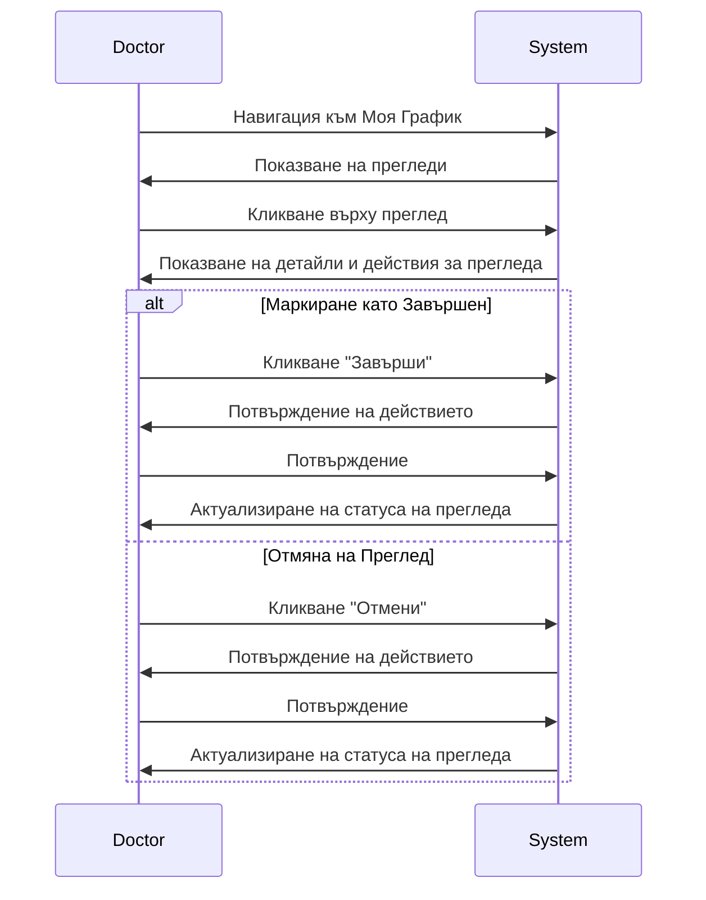

# Ръководство за Потребители

Това ръководство предоставя инструкции за използване на Системата за Медицински Прегледи както за пациенти, така и за лекари.

## Начало на Работата

### Достъп до Системата

1. Отворете вашия уеб браузър и навигирайте до URL адреса на приложението
2. Ще бъдете пренасочени към страницата за вход

### Създаване на Акаунт

1. Кликнете върху бутона "Регистрация" на страницата за вход
2. Попълнете вашето потребителско име и парола
3. Изберете типа на вашия акаунт (Пациент или Лекар)
4. Ако избрахте "Лекар", въведете вашата медицинска специалност
5. Кликнете "Регистрация" за създаване на акаунта
6. Ще бъдете автоматично вписани и пренасочени към вашето табло

### Вход в Системата

1. Въведете вашето потребителско име и парола на страницата за вход
2. Кликнете "Вход"
3. Ще бъдете пренасочени към вашето табло според типа на вашия акаунт

## Ръководство за Пациенти

### Преглед на Таблото

Таблото за пациенти предоставя достъп до следните функционалности:

- Преглед на предстоящи и минали прегледи
- Запазване на нови прегледи
- Преглед на профили на лекари

### Запазване на Преглед

1. Кликнете върху "Запази Преглед" в навигационното меню
2. Разгледайте списъка с налични лекари
3. Изберете лекар, за да видите неговия профил и наличност
4. Изберете дата от календара (наличните дати ще бъдат маркирани)
5. Изберете наличен час
6. Кликнете "Запази Преглед" за потвърждение
7. Ще видите съобщение за потвърждение и прегледът ще се появи в списъка с вашите прегледи

### Преглед на Прегледите

1. Кликнете върху "Моите Прегледи" в навигационното меню
2. Разгледайте списък с всички ваши прегледи, подредени по дата
3. Всеки преглед показва:
   - Име и специалност на лекара
   - Дата и час
   - Статус (запазен, завършен или отменен)

### Управление на Прегледите

- Не можете да отменяте прегледи директно. Ако трябва да отмените, моля, свържете се с медицинското заведение.
- Завършените прегледи ще бъдат маркирани като такива след като лекарът актуализира техния статус.

## Ръководство за Лекари

### Преглед на Таблото

Таблото за лекари предоставя достъп до следните функционалности:

- Преглед на предстоящи и минали прегледи
- Управление на статуса на прегледите
- Задаване на наличност

### Задаване на Наличност

1. Кликнете върху "Управление на Наличност" в навигационното меню
2. Ще видите текущите настройки на вашата наличност
3. За добавяне на нова наличност:
   - Изберете ден от седмицата
   - Задайте начален и краен час
   - Кликнете "Добави Наличност"
4. За премахване на наличност:
   - Намерете часа, който искате да премахнете
   - Кликнете бутона "Изтрий" до него

### Преглед на Графика

1. Кликнете върху "Моя График" в навигационното меню
2. Разгледайте вашите прегледи в:
   - Изглед списък: Хронологичен списък на прегледите
   - Изглед календар: Визуален календар с прегледи

### Управление на Прегледите

1. От вашия график, кликнете върху преглед, за да видите детайли
2. За запазени прегледи можете да:
   - Маркирате като завършен (след като прегледът е извършен)
   - Отмените (ако прегледът не може да се състои)
3. Кликнете съответния бутон и потвърдете действието
4. Статусът на прегледа ще бъде актуализиран

## Общи Функционалности

### Управление на Профил

1. Кликнете върху вашето потребителско име в горния десен ъгъл
2. Изберете "Профил" от падащото меню
3. Разгледайте и редактирайте информацията във вашия профил
4. Кликнете "Запази Промените" за актуализиране на профила

### Изход от Системата

1. Кликнете върху вашето потребителско име в горния десен ъгъл
2. Изберете "Изход" от падащото меню
3. Ще бъдете изписани и пренасочени към страницата за вход

## Отстраняване на Проблеми

### Често Срещани Проблеми

1. **Не може да влезете**

   - Проверете дали използвате правилното потребителско име и парола
   - Уверете се, че caps lock не е активиран
   - Ако сте забравили паролата си, свържете се с системната администрация

2. **Няма налични часове**

   - Лекарът може да не е задал наличност за избраната дата
   - Всички часове за този ден може вече да са запазени
   - Опитайте да изберете друга дата или лекар

3. **Не можете да видите прегледите**
   - Уверете се, че сте вписани с правилния акаунт
   - Проверете интернет връзката си
   - Опитайте да опресните страницата

### Получаване на Помощ

Ако срещнете проблеми, които не са описани в това ръководство, моля, свържете се с системната поддръжка на support@medical-appointment-system.com или обадете се на нашата помощна линия на (555) 123-4567. 