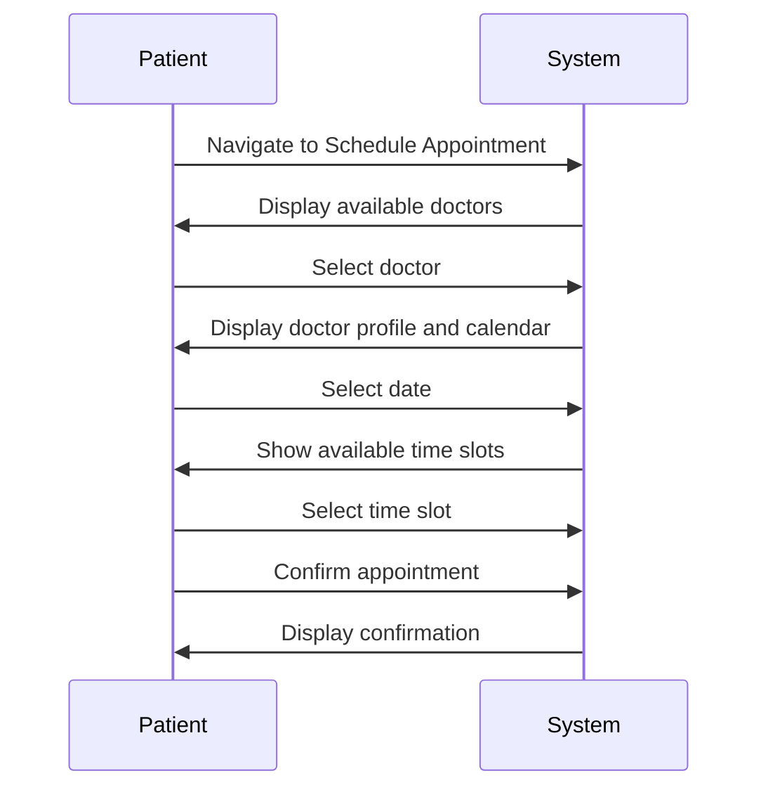
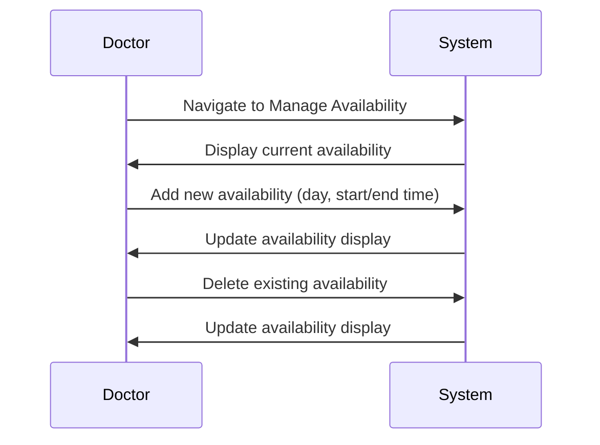
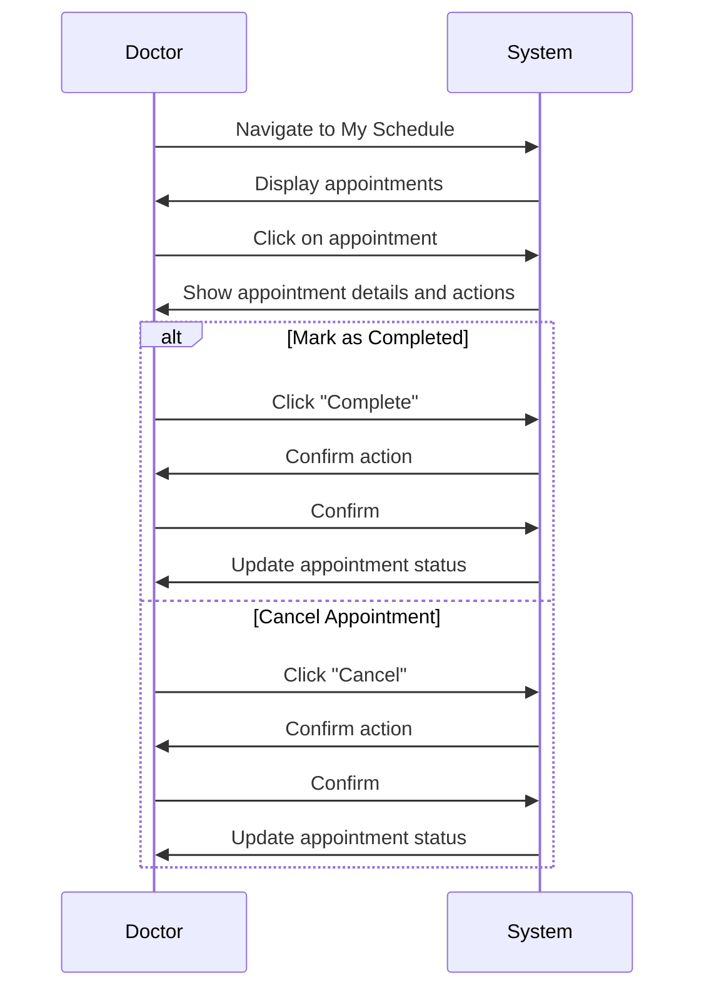

# User Guide

This guide provides instructions for using the Medical Appointment System for both patients and doctors.

## Getting Started

### Accessing the System

1. Open your web browser and navigate to the application URL
2. You will be directed to the login page

### Creating an Account

1. Click on the "Register" button on the login page
2. Fill in your username and password
3. Select your account type (Patient or Doctor)
4. If you selected "Doctor", enter your medical specialty
5. Click "Register" to create your account
6. You will be automatically logged in and redirected to your dashboard

### Logging In

1. Enter your username and password on the login page
2. Click "Login"
3. You will be redirected to your dashboard based on your account type

## Patient Guide

### Dashboard Overview

The patient dashboard provides access to the following features:

- View upcoming and past appointments
- Schedule new appointments
- View doctor profiles

### Scheduling an Appointment

1. Click on "Schedule Appointment" in the navigation menu
2. Browse the list of available doctors
3. Select a doctor to view their profile and availability
4. Choose a date from the calendar (available dates will be highlighted)
5. Select an available time slot
6. Click "Schedule Appointment" to confirm
7. You will see a confirmation message and the appointment will appear in your appointments list

### Viewing Appointments

1. Click on "My Appointments" in the navigation menu
2. View a list of all your appointments, sorted by date
3. Each appointment shows:
   - Doctor name and specialty
   - Date and time
   - Status (scheduled, completed, or cancelled)

### Managing Appointments

- You cannot cancel appointments directly. If you need to cancel, please contact the medical facility.
- Completed appointments will be marked as such after the doctor updates their status.

## Doctor Guide

### Dashboard Overview

The doctor dashboard provides access to the following features:

- View upcoming and past appointments
- Manage appointment status
- Set availability

### Setting Availability

1. Click on "Manage Availability" in the navigation menu
2. You will see your current availability settings
3. To add new availability:
   - Select a day of the week
   - Set start and end times
   - Click "Add Availability"
4. To remove availability:
   - Find the availability slot you want to remove
   - Click the "Delete" button next to it

### Viewing Schedule

1. Click on "My Schedule" in the navigation menu
2. View your appointments in either:
   - List view: Chronological list of appointments
   - Calendar view: Visual calendar with appointments

### Managing Appointments

1. From your schedule, click on an appointment to view details
2. For scheduled appointments, you can:
   - Mark as completed (after the appointment has taken place)
   - Cancel (if the appointment cannot be kept)
3. Click the appropriate button and confirm your action
4. The appointment status will be updated

## Common Features

### Profile Management

1. Click on your username in the top-right corner
2. Select "Profile" from the dropdown menu
3. View and edit your profile information
4. Click "Save Changes" to update your profile

### Logging Out

1. Click on your username in the top-right corner
2. Select "Logout" from the dropdown menu
3. You will be logged out and redirected to the login page

## Troubleshooting

### Common Issues

1. **Cannot log in**

   - Verify that you are using the correct username and password
   - Ensure caps lock is not enabled
   - If you've forgotten your password, contact system administration

2. **No available time slots**

   - The doctor may not have set availability for the selected date
   - All slots for that day may already be booked
   - Try selecting a different date or doctor

3. **Cannot see appointments**
   - Ensure you are logged in with the correct account
   - Check your internet connection
   - Try refreshing the page

### Getting Help

If you encounter any issues not covered in this guide, please contact system support at support@medical-appointment-system.com or call our help desk at (555) 123-4567.
