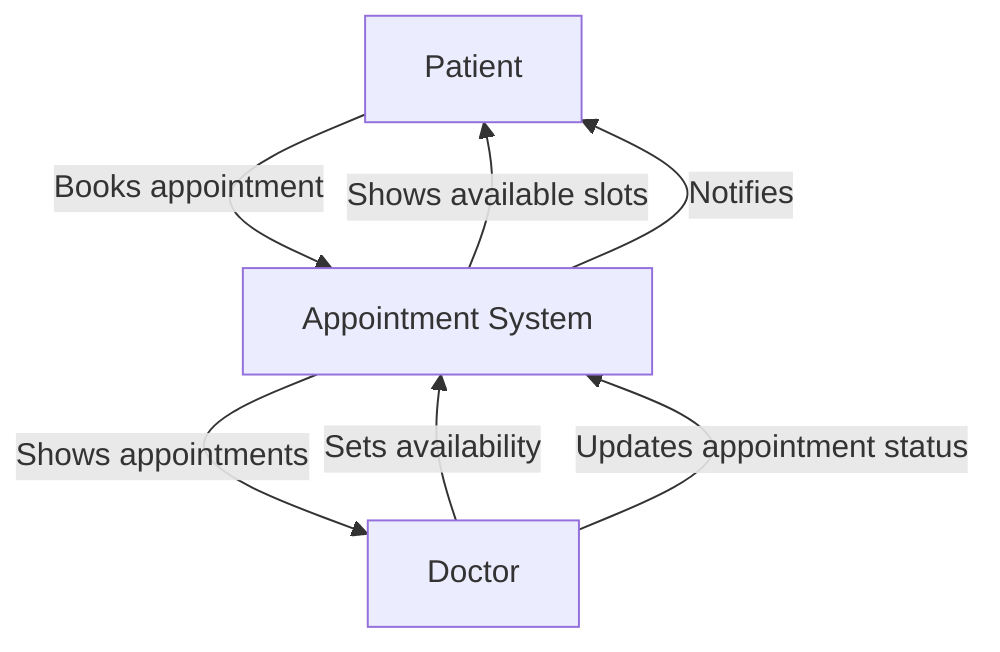

# Medical Appointment System

Welcome to the Medical Appointment System documentation. This comprehensive documentation covers both the frontend and backend APIs of our system, designed to streamline appointment scheduling between doctors and patients.

## System Overview

The Medical Appointment System is a full-stack application that enables efficient management of doctor appointments, schedule tracking, and patient bookings. It features role-based access for different user types and a real-time appointment scheduling system.

## Key Features

- **User Authentication**: Secure login and registration system for patients and doctors
- **Appointment Scheduling**: Patients can schedule appointments with available doctors
- **Doctor Availability Management**: Doctors can set and manage their availability
- **Appointment Status Tracking**: Track appointments as scheduled, completed, or cancelled
- **Calendar Integration**: Visual calendar interface for appointment management

## Documentation Structure

This documentation is structured as follows:

- **Getting Started**: Installation instructions and architecture overview
- **Backend API**: Detailed documentation of backend REST API endpoints
- **Frontend API**: Documentation of frontend service interfaces
- **User Guides**: Comprehensive guides for system usage

## Technical Stack

- **Frontend**: React, Material UI, TypeScript
- **Backend**: Node.js, Express, TypeScript
- **Database**: PostgreSQL with Prisma ORM
- **Authentication**: JWT-based authentication

## Quick Links

- [Installation Guide](guides/installation.md)
- [Backend API Overview](api/backend/index.md)
- [Frontend API Overview](api/frontend/index.md)
- [User Guide](guides/user-guide.md)
- [Developer Guide](guides/developer-guide.md)
