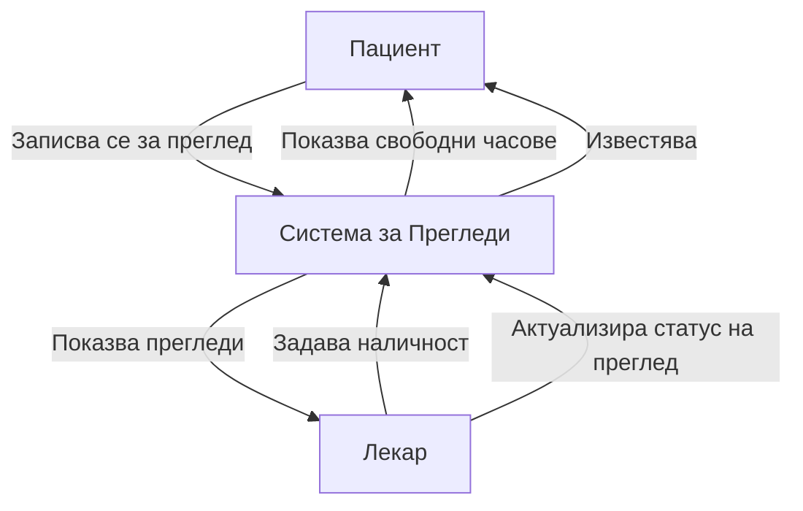

# Система за Медицински Прегледи

Добре дошли в документацията на Системата за Медицински Прегледи. Тази подробна документация покрива както frontend, така и backend API на нашата система, проектирана за оптимизиране на процеса на записване за прегледи между лекари и пациенти.

## Системен Преглед

Системата за Медицински Прегледи е пълноценно приложение, което позволява ефективно управление на прегледите при лекари, проследяване на графика и записване на пациенти. Тя включва достъп базиран на роли за различни типове потребители и система за планиране на прегледи в реално време.

## Основни Функционалности

- **Автентикация на Потребители**: Сигурна система за вход и регистрация за пациенти и лекари
- **Планиране на Прегледи**: Пациентите могат да записват прегледи при налични лекари
- **Управление на Наличността на Лекарите**: Лекарите могат да задават и управляват своята наличност
- **Проследяване на Статуса на Прегледите**: Следене на прегледите като записани, завършени или отменени
- **Интеграция с Календар**: Визуален календарен интерфейс за управление на прегледите

## Структура на Документацията

Тази документация е организирана по следния начин:

- **Начало на Работата**: Инструкции за инсталиране и преглед на архитектурата
- **Backend API**: Подробна документация на backend REST API endpoints
- **Frontend API**: Документация на frontend service интерфейсите
- **Ръководства за Потребители**: Изчерпателни ръководства за използване на системата

## Технически Стек

- **Frontend**: React, Material UI, TypeScript
- **Backend**: Node.js, Express, TypeScript
- **База Данни**: PostgreSQL с Prisma ORM
- **Автентикация**: JWT базирана автентикация

## Бързи Връзки

- [Ръководство за Инсталиране](guides/installation.md)
- [Преглед на Backend API](api/backend/index.md)
- [Преглед на Frontend API](api/frontend/index.md)
- [Ръководство за Потребители](guides/user-guide.md)
- [Ръководство за Разработчици](guides/developer-guide.md) 